# 1. 入门情景

## 1.1. 单机解决

- 情景 1：
  - 情景：
    ```
    1T文本文件，每行一个数据
    128MB内存计算机
    求重复行
    ```
  - 解决 1：
    - 方式：
      ```
      每次读取一行
      对一行的数据求hash值
      将hash为文件名，一行数据为文件内容，存入磁盘
      每行对应一个文件（n:1，重复行hash值也相同）
      遍历所有文件，查行数大于1的文件
      ```
    - 问题
      - 单服务器问题：
        - 单点瓶颈：一个计算机性能有限
        - 单点故障：一个服务器出故障后整个服务瘫痪
      - 文件过多，遍历压力大
  - 解决 2：
    > **hash 稳定算法**
    - 方式；
      ```
      每次读一行
      求hash值，再膜10000
      将hash%10000相同的数据存放到一个文件中（相当于初步分组，将文件数量控制在10000）
      （hash稳定算法，控制文件数量同时达到负载均衡的效果，hadoop和redis中都有相关扩展和应用）
      ```
    - 问题；
- 情景 2
  - 情景：
    ```
    1T文本数据
    128MB计算机
    每行一个数字
    对文件进行全排序
    ```
  - 解决 1：单文件无序，文件间有序
    ```
    划分多个文件存储范围，（0-100，,101-200，201-300....）
    将1T数据分别存到多个文件中
    对每个文件中的数据进行排序
    按顺序合并多个文件
    ```
  - 解决 2：单文件有序，文件间无序
    ```
    每次从1T数据中拿出一定量数据（小于128MB）进行排序，存到一个文件中
    最终把1T分割成多个有序的小文件
    使用归并算法，将小文件合并为一个有序的大文件
      0. 新建空白结果文件
      1. 每个文件中取第一个（最小的数据），放到内存中
      2. 将内存中最小的数(假设来自文件a)追加到结果文件
      3. 将文件a中最小的数补充到内存中
      4. 重复1-3
    ```

## 1.2. 分布式解决(cluster)

- 情景 1

  - 情景：
    ```
    1T文本文件，每行一个数据
    2000个服务器128MB内存
    求重复行
    ```
  - 解决 1：
    - 方式；
      ```
      每个服务器分500MB文件
      每个服务器
        每行求hash再膜2000，以此为文件名
        生成2000个文件
      从每台服务器中取文件名相同的文件 比如1，放到额外一台更高内存服务器上
      再查找相同行
      ```
    - 问题：
      - 1T 数据切割分发给 2000 台服务器
        ```
        分到2000台服务器，一台服务器分500MB数据
        向一个服务器发送500MB需要5s，则2000台服务器需要10000s（两个半小时）
        ```
      - 数据迁移，同名文件迁移到同一个服务器花费时间
        ```
        千兆网卡处理速度为百兆级
        假设文件均匀分布，所有文件名为1的总和大小为500MB
        并且通过算法解决了io冲撞问题，并满速传输
        那么传输到一台服务器需要5s
        ```

- 实际情景：

  ```
  假设每天有1T数据
  每天都会花费一定时间进行数据的分发
  每台服务器每次增加较少数据量
  每台服务器并行执行，计算耗费时间可控
  ```

- 分布式集群：
  > 分而治之，并行计算
  - 并行：提升速度的关键
  - 分布式执行
  - 计算与数据一起
  - 文件切割的规范管理
    > 数据切割后存放管理策略
  - 存+计算
    - 计算向数据移动
      ```
      hadoop精华所在
      数据量非常大，迁移耗费时间大
      所以把计算程序向程序移动
      ```
  - 应用
    - Net music log 播放次数，标签等
    - 有线电视日志统计,点击率，换台时机，计算观看率等

# 2. hadoop

## 2.1. 简介

- 思想之源：Google（第一个遇到大数据问题的公司）
- 面对数据和计算难题：
  - 大量网页怎么存储
  - 搜索算法
- Google 三大理论

  - GFS：分布式文件系统
  - Map-Reduce:分布式计算框架
  - Bigtable

- Doug cutting 看完 google 论文后，在 Yahoo 就职期间开发的 hadoop 框架

- hadoop 底层基于倒排索引

  - 倒排索引：即 luence 框架
    > 苹果动态搜索引擎就基于 luence 框架
    > 之后会学

- 历程：
  ```
  Hadoop简介
  名字来源于Doug Cutting儿子的玩具大象。
  2003-2004年，Google公开了部分GFS和Mapreduce思想的细节，以此为基础Doug Cutting等人用了2年业余时间实现了DFS和Mapreduce机制，一个微缩版的Nutch(nutch:第一个开源的分布式搜索框架，apache公司)
  Hadoop 于 2005 年秋天作为 Lucene的子项目 Nutch的一部分正式引入Apache基金会。2006 年 3 月份，Map-Reduce 和 Nutch Distributed File System (NDFS) 分别被纳入称为 Hadoop 的项目
  ```
- Hadoop 简介：https://hadoop.apache.org/old/
  - 版本：1.x，2.x，3.x
  - 组成：
    - 大数据工具包：Hadoop Commom
    - 分布式存储系统 HDFS （Hadoop Distributed File System ）POSIX
      - 分布式存储系统
      - 对数据文件切割并进行分发
      - 提供了 高可靠性、高扩展性和高吞吐率的数据存储服务
    - 分布式资源管理框架 YARN（Yet Another Resource Management）
      - 负责集群资源的管理和调度
    - 分布式计算框架 MapReduce
      - 分布式计算框架（计算向数据移动）
      - 具有 易于编程、高容错性和高扩展性等优点。
  - 衍生（生态环境圈）：
    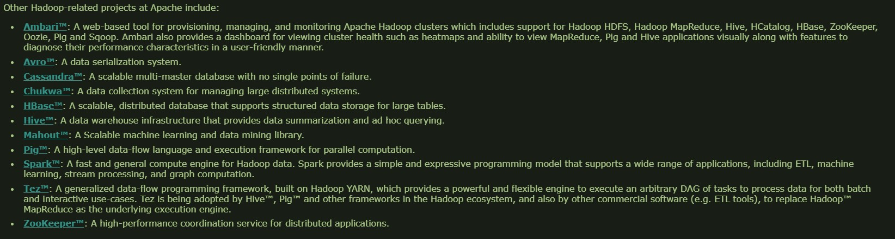

## 2.2. 分布式文件系统 HDFS

> 就是一个文件系统，操作类似 linux

### 2.2.1. 存储模型

> 就是上面的完整数据进行切割

- 存储模型：字节
  - 文件线性切割成块（Block）:偏移量 offset
    - Block:切成的块
    - offset：偏移量，起始位置。用于索引定位
    - 中文处理：切割时不管，后期会进行处理
  - Block 分散存储在集群节点中
    > 尽量均衡分配
  - 单一文件 Block 大小一致，文件与文件可以不一致
    > 除最后一个块大小相同
  - Block 可以设置副本数，副本无序分散在不同节点中
    > 切出的块进行复制，散布在不同节点上，是为了数据安全
    - 副本数不要超过节点数量，没有意义
  - 文件上传可以设置 Block 大小和副本数（资源不够开辟的进程）
    - Block 大小默认 128MB，最小 1MB。可以自行设置
    - 副本数默认 3 个。可以自行设置
      > 比如有多个进程需要读取数据块，可以把副本数设置多些，将进程分散到不同服务器，避免造成拥堵现象
  - 已上传的文件 Block 副本数可以调整，**大小不变**
  - 只支持一次写入多次读取，同一时刻只有一个写入者
  - 可以 append 追加数据
    > 把数据添加到最后一块,或者追加数据作为最后一块。

### 2.2.2. 架构模型

> 通过一定的有序的组织架构，让架构运行起来并对数据进行健康完美的维护的模型

- 1.0 版本架构模型：主从架构模型
  > 一个主节点，管理多个从节点
  - 数据种类：
    - 元数据 MetaData
      - 文件权限
      - 每个块的块大小
      - 每个块的块偏移量
      - ......（持久化那里有）
    - 块数据本身，文件数据
  - 分工：
    - 主节点(NameNode)：保存和维护文件元数据：单节点 posix
    - 从节点(DataNode)：保存和处理文件 Block 数据：多节点
  - 主从交互
    - DataNode 与 NameNode 保持心跳，提交 Block 列表
      > DataNode 向 NameNode 主动提交 Block 列表
  - 客户端，CS 架构
    - HdfsClient 与 NameNode 交互元数据信息
    - HdfsClient 与 NameNode 交互获得指定块的位置，再直接与 DataNode 交互文件 Block 数据
  - 存储：
    - DataNode 利用服务器本地文件系统存储数据块

### 2.2.3. 架构模型

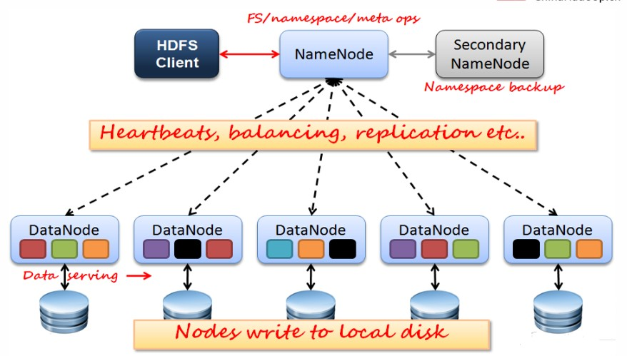

- HdfsClient 能与 DataNote 直接交互，这里没画出来
- Secondary NameNode:1.0 版本中比较重要。2.0 及之后就用不到了

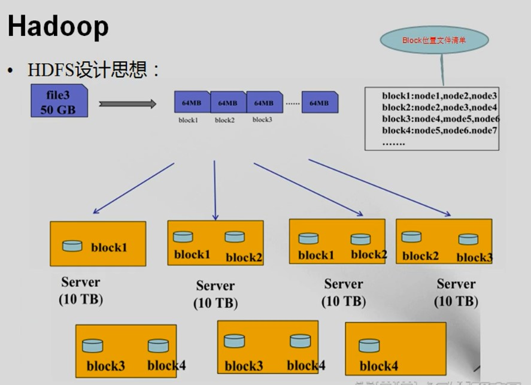

### 2.2.4. 节点类型与版本 1.0 持久化

- NameNode（NN）

  - **基于内存存储** ：不会和磁盘发生交换（双向）
    > 与 redis 等内存数据库相同
    - 只存在内存中，进行计算
    - 定期做持久化（单向）
      > 只会把内存中的数据写到磁盘备份<br>
      > 只有恢复数据时才读取数据
  - NameNode 主要功能：
    - 接受客户端的读写服务
    - 收集 DataNode 汇报的 Block 列表信息
  - NameNode 保存 metadata 信息包括
    - 文件持有者(owership)和(permissions)
    - 文件大小，时间
    - Block 信息（Block 列表，Block 偏移量，Block 副本位置）（**持久化不存**）
      > 由 DataNode 主动将块数据的信息汇报给 NameNode，确保 DataNode 的存活，不用存储

- DataNode（DN）

  - 本地磁盘目录存储数据（Block），文件形式
  - 同时存储 Block 的元数据信息文件(MD5 文件,(MD5 加密))
    > 该元数据信息对应 Block
  - 启动 DN 时会向 NN 汇报 block 信息
  - 通过向 NN 发送心跳保持与其联系（3 秒一次），如果 NN 10 分钟没有收到 DN 的心跳，则认为其已经 lost，并 copy 其上的 block 到其它 DN
    > 之后会自动从其他节点上查找副本数据恢复节点数据<br>
    > 另外因为数据量大，判断 lost 的间隔不能太小，否则数据转移对服务器压力太大，期间也可能修复，10 分钟差不多。

- NameNode 持久化

  - 方式：
    - metadata 存储到磁盘文件名为”fsimage”（时点备份）
      - fsimage:镜像快照
      - 是实现 java 序列化接口的对象序列化后的文件
      - 序列化写入磁盘慢，但恢复时快，因为就是二进制文件，直接读入内存即可
    - edits 记录对 metadata 的操作日志-->Redis
      - edits log
      - 会把客户端对 NameNode 的所有操作写到操作日志中
      - 写入块，但恢复很慢，因为要一条一条执行
    - 实际会两者混用
      - 最开始启动时，hadoop 会格式化(format)，生成空白 fsimage 和 edits
      - 进行操作时，会把操作记录存储到 edits 中，不会修改 fsimage
      - 每次当 edits 到达一定条件时(比如文件大小)，会触发 fsimage 合并工作
        - 以 fsimage 为基础，读取 edits 中的内容进行合并
        - fsimage 更新后，edits 会被清空
        - 而做合并工作的，就是 **SecondNameNode(SNN)**
  - 特点：
    - NameNode 的 metadata 信息在启动后会加载到内存
    - Block 的位置信息不会保存到 fsimage

- SecondNameNode
  - 它不是 NN 的备份（但可以做备份），它的主要工作是帮助 NN 合并 edits log，减少 NN 启动时间。
  - SNN 执行合并时机
    - 根据配置文件设置的时间间隔 fs.checkpoint.period 默认 3600 秒
    - 根据配置文件设置 edits log 大小 fs.checkpoint.size 规定 edits 文件的最大值默认是 64MB
  - 合并流程:
    > 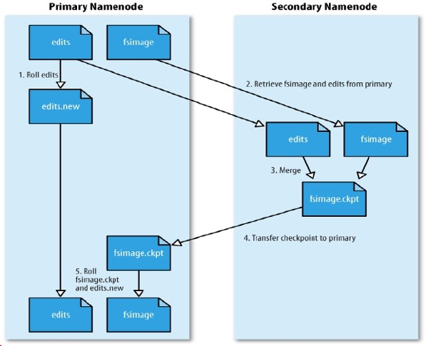
  - 恢复流程：
    - 读取 fsimage
    - 如果 edits 文件不为空，就读取并执行
  - 2.x 之后有了 NameNode 备份，SecondeNameNode 基本没用了
    - 之后会讲持久化工作的替代者

### 2.2.5. 优缺点

- HDFS 优点：
  - 高容错性
    > block management policy 副本管理策略
    - 数据自动保存多个副本
    - 副本丢失后，自动恢复
  - 适合批处理
    - **移动计算而非数据**
    - 数据位置暴露给计算框架（Block 偏移量）
  - 适合大数据处理
    - GB 、TB 、甚至 PB 级数据
    - 百万规模以上的文件数量
  - 可构建在廉价机器上
    - 通过多副本提高可靠性
    - 提供了容错和恢复 机制
- HDFS 缺点：
  - 做不到低延迟数据访问,比如毫秒级
    > 因为数据量很大，基本上是分钟级别的。
    - 高吞吐率，要求块大小不能小于 1MB
  - 小文件存取效率底下
    - 占用 NameNode 大量内存
      > 比如 10 亿个小文件，需要维护的元数据信息量非常大
    - 寻道时间超过读取时间
      > 寻找 10 亿个文件耗时多，所以尽量使文件大些，文件少些，减少寻道时间
  - 并发写入、文件随机修改
    - 一个文件只能有一个写者
    - 仅支持 append

### 2.2.6. 副本放置策略

- 服务器类型：

  - 塔式服务器，类似家用计算机主机
  - 机架服务器，扁平，放在架子上
    > 用得多
  - 刀片服务器，

- 组网模式：

  - 老式：
    > 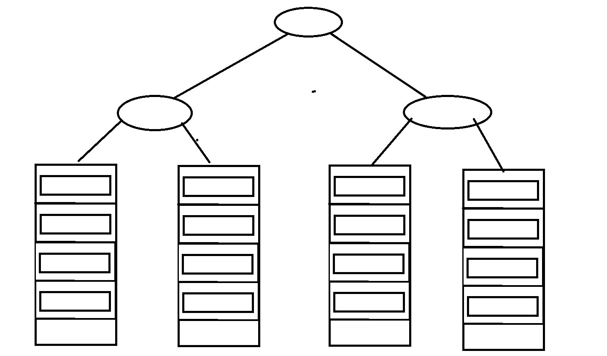
  - 平面组网
    > 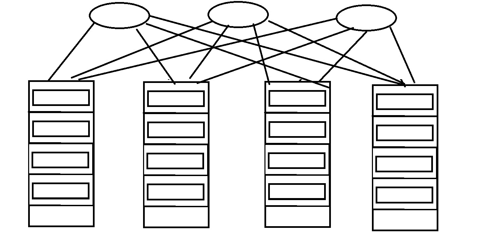

- Block 的副本放置策略
  > 不同服务器策略和组网模式方式策略不同
  > hadoop-hdfs-2.6.5.jar--org.apache.hadoop.hdfs.blockmanagement--BlockPlacePolicyDefault 类中注释有副本方式策略
  - 机架服务器
    - 第一个副本：放置在上传文件的 DN；如果是集群外提交，则随机挑选一台磁盘不太满，CPU 不太忙的节点。
    - 第二个副本：放置在于第一个副本不同的 机架的节点上。
    - 第三个副本：与第二个副本相同机架的节点。
    - 更多副本：随机节点

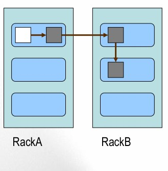

> rack 机架

### 2.2.7. 核心流程

- 写流程(动作执行者为 client)：

  > 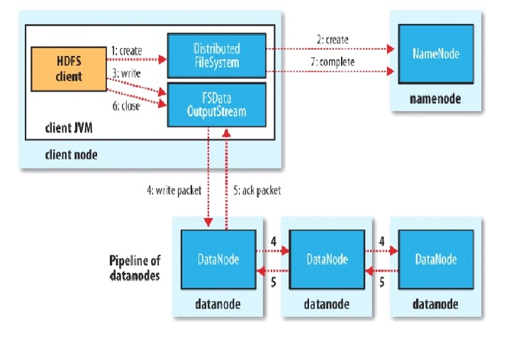
  > DistributedFileSystem， FSDataOutputStream 为两个对象，后者由前者创建，之后用的时候会更了解，此处不多讲<br>
  > FSDataOutputStream 只会向第一个副本节点传输数据<br>
  > FSDDataOutputStream 和 DataNode 之间可以看作管道，流式传输，FSDDataOutputStream 发送的数据包会流过三个 DataNode<br>
  > 确认只发生在 Client 和第一个 DataNode 之间。所有 DataNode 一直和 NameNode 一直保持着通信，所以不必担心无法获知 block 是否传输完整<br>
  > 时间重叠：第一个 DataNode 传完之后，会立即启动下一个 block 的传输，但此时第二和第三个 DataNode 依旧在接收数据

  - 选择文件
  - 切分文件 Block
  - 按 Block 线性和 NN 获取 DN 列表（副本数）
  - 验证 DN 列表后以更小的单位流式传输数据
    - 各节点，两两通信确定可用
  - Block 传输结束后：
    - DN 向 NN 汇报 Block 信息
    - DN 向 Client 汇报完成
    - Client 向 NN 汇报完成
  - 获取下一个 Block 存放的 DN 列表
  - 。。。。。。
  - 最终 Client 汇报完成
  - NN 会在写流程更新文件状态

- 读流程(动作执行者为 client)：
  > 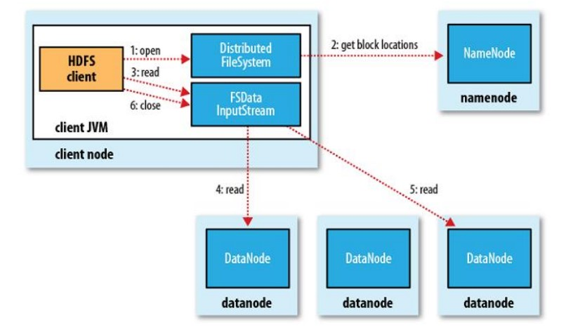
  > 本地读取策略：就近原则多个副本时，会读取最近的空闲的服务器
  - 和 NN 获取一部分 Block 副本位置列表
  - 线性和 DN 获取 Block，最终合并为一个文件
  - 在 Block 副本列表中按距离择优选取
  - MD5 验证数据完整性

### 2.2.8. HDFS 其他

- 文件权限

  - HDFS 文件权限:POSIX 标准（可移植操作系统接口）
    - POSIX:Portable Operating System Interface
    - 与 Linux 文件权限类似
      - r: read; w:write; x:execute
      - 权限 x 对于文件忽略，对于文件夹表示是否允许访问其内容
    - 如果 Linux 系统用户 zhangsan 使用 hadoop 命令创建一个文件，那么这个文件在 HDFS 中 owner 就是 zhangsan。
    - HDFS 的权限目的：阻止误操作，但不绝对。HDFS 相信，你告诉我你是谁，我就认为你是谁。

- 安全模式；

  - namenode 启动的时候，首先将映像文件(fsimage)载入内存，并执行编辑日志(edits)中的各项操作。
  - 一旦在内存中成功建立文件系统元数据的映射，则创建一个新的 fsimage 文件(这个操作不需要 SecondaryNameNode)和一个空的编辑日志。
  - 此刻 namenode 运行在安全模式。即 namenode 的文件系统对于客服端来说是只读的。(显示目录，显示文件内容等。写、删除、重命名都会失败，尚未获取动态信息)。
  - 在此阶段 Namenode 收集各个 datanode 的报告，当数据块达到最小副本数以上时，会被认为是“安全”的， 在一定比例（可设置）的数据块被确定为“安全”后，再过若干时间，安全模式结束
  - 当检测到副本数不足的数据块时，该块会被复制直到达到最小副本数，系统中数据块的位置并不是由 namenode 维护的，而是以块列表形式存储在 datanode 中。

- 角色==进程
  - namenode
    - 数据元数据
    - 内存存储，不会有磁盘交换
    - 持久化（fsimage，edits log）
      - 不会持久化 block 的位置信息
    - block：偏移量，因为 block 不可以调整大小，hdfs，不支持修改文件
      - 偏移量不会改变
  - datanode
    - block 块数据，块元数据信息
    - 磁盘
    - 面向文件，大小一样，不能调整
    - 副本数，可调整，（备份，高可用，容错/可以调整很多个，为了计算向数据移动）
  - SN(2.x 版本中就没了)
  - NN&DN
    - 心跳机制
    - DN 向 NN 汇报 block 信息
    - 安全模式
  - client

### 2.2.9. 根据官网部署伪分布式

> 具体请查看搭建文档 

- 可以有三种模式进行部署：

  - Local (Standalone) Mode：本地多线程方式模拟 hadoop 运作，测试时用用，一般不用
  - Pseudo-Distributed Mode：伪分布式。主从节点放到一个机器上
  - Fully-Distributed Mode：全分布式。

- 伪分布式：
  - 设置 ssh 免密码登录
    - ssh-keygen -t dsa -P '' -f ~/.ssh/id_dsa
    - cat ~/.ssh/id_dsa.pub >> ~/.ssh/authorized_keys
    - scp ./authorized_keys ......
  - 安装 jdk，设置环境变量
  - 二次修改环境变量。vi /opt/learn/hadoop-2.6.5/etc/hadoop-env.sh
    > 因为其他服务器上不一定修改了 profile，干脆在 hadoop 配置文件中修改得了
    ```sh
    export JAVA_HOME=${JAVA_HOME}
    # 改为
    export JAVA_HOME=/usr/java/jdk1.7.0_67
    ```
    - 顺便把所有块 mapred-env.sh,yarn-env.sh 也都改了
  - 根据官方修改
    - core-site.xml：主节点配置文件
      > Localhost 改成 node0001
    - hdfs-site.xml：分布式文件系统配置文件。副本数量，伪分布式部署，默认为 1
    - slave:DataNode 从节点列表文件。
  - 设置 DataNode ：slaves 文件 , 改为 node0001
  - 进入 hdfs-site.xml 配置 SecondNameNode 角色进程
    > 查看默认配置：
    > 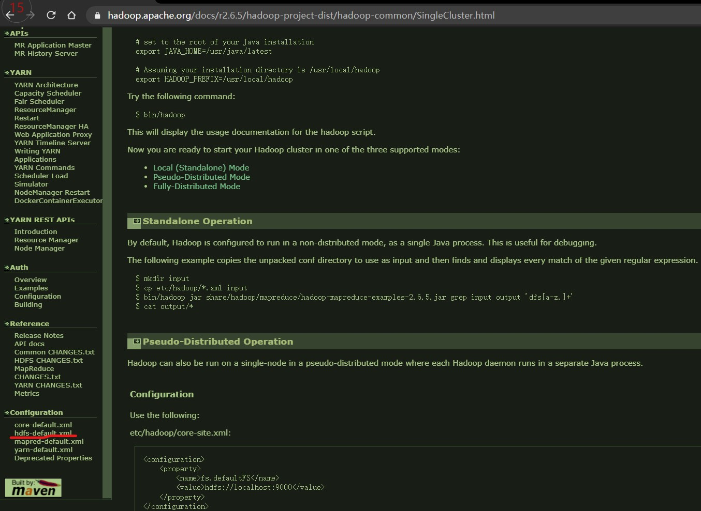
    ```xml
    <property>
        <name>dfs.namenode.secondary.http-address</name>
        <value>node0001:50090</value>
    </property>
    ```
  - 修改 core-site.xml
    > 同样方式查找默认配置
    - hdfs 中将元数据信息保存到，同时块数据也在该路径下
      >  > 
    - hadoop.tmp.dir 在 core-site.xml 中设置，默认`/tmp/hadoop-${user.name}`
    - 如果默认的话，一清楚 tmp 文件就玩完
    - 所以要修改下
      ```xml
      <configuration>
          <property>
              <name>fs.defaultFS</name>
              <value>hdfs://node0001:9000</value>
              <!-- NameNode主节点配置角色进程 -->
          </property>
          <property>
              <name>hadoop.tmp.dir</name>
              <value>/var/learn/hadoop/pseudo</value>
              <!-- 伪分布式相关文件配置位置 -->
          </property>
      </configuration>
      ```
  - 格式化 NameNode
    > DataNode,SecondNameNode 在启动时会生成相关文件，格式化只针对 NameNode<br>
    > edits 文件启动后生成
  - 查看/var/learn/hadoop/pseudo 下的文件
    - name 文件夹：namenode 元数据信息
      - current
        - fsimage_0000000000000000000
        - fsimage_0000000000000000000.md5
        - seen_txid
        - VERSION
          > 里面的 clusterID<br>
          > 集群唯一标识号，format 阶段形成，给所有角色共享<br>
          > 格式化一次就会变一次，但其他角色 id 不会变。所以不要多次启动<br>
          > 解决方式：手动修改回去。把 NameNode 改成和 DataNode 以及 SecondNameNode 一样，
          > 或者把所有其他的改成和 NameNode 一样
  - 启动
    > 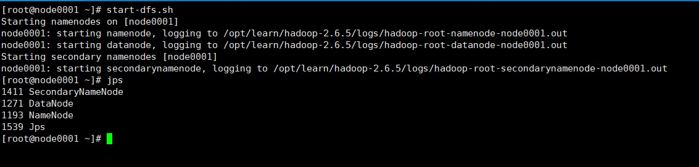 > 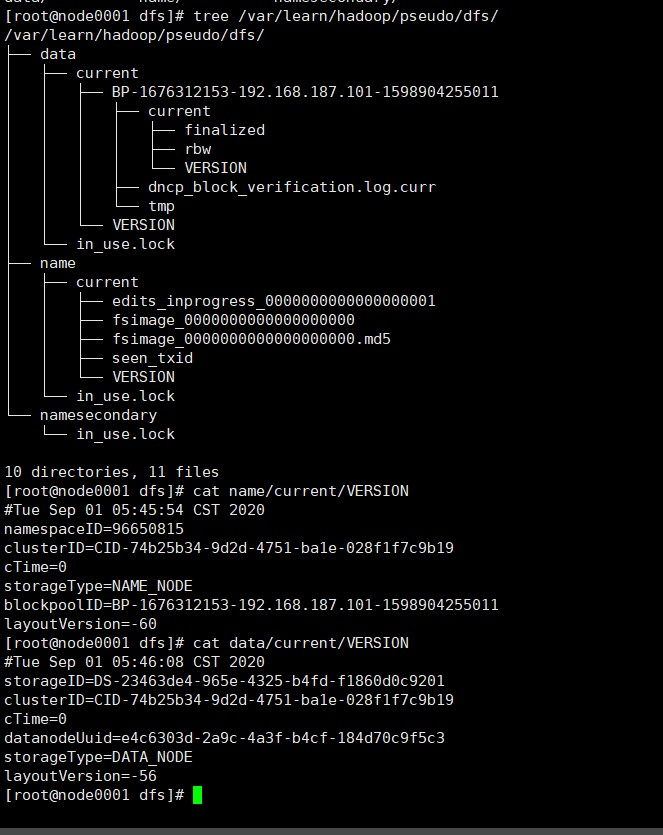
  - 可以在浏览器进入`192.168.187.101:50070`查看负载情况
    > `ss -nal` 查看 socket 监听接口
    - Live Nodes 指的是 DataNode 节点
  - NameNode 创建路径，再上传文件
    - hdfs dfs 可以查看所有文件管理命令，贴近于 linux
    - hdfs dfs -mkdir -p /user/root
      > 上传文件的默认路径
    - hdfs dfs -ls 查看所有文件夹
  - 上传文件
    - hdfs dfs -put ~/files/hadoop-2.6.5.tar.gz /user/root
    - copying 状态不可访问
      > 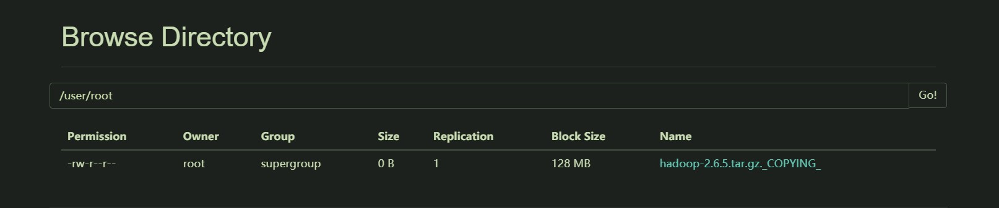
    - 上传完后，可以查看 block（默认 128MB，所以就是两块）
      > 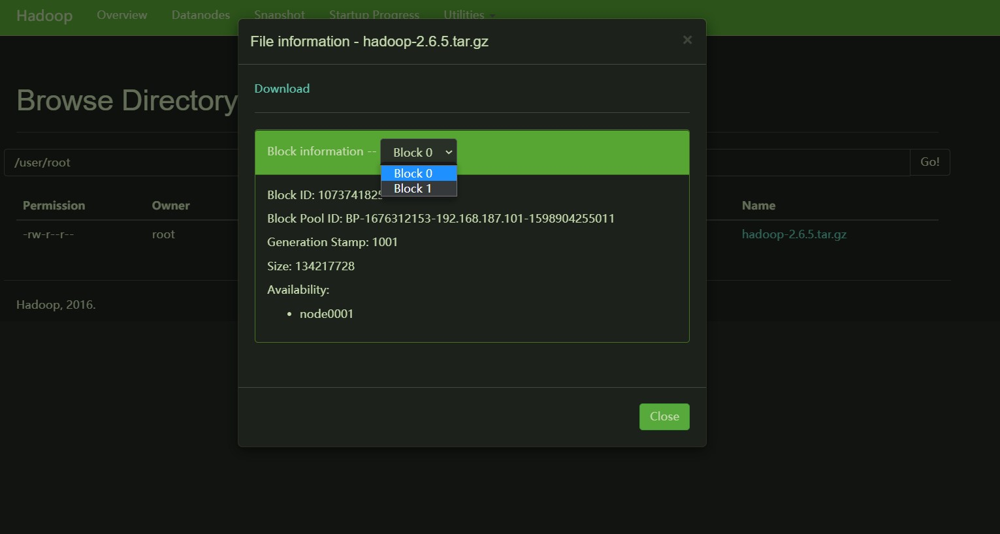
    - 快文件存储在/var/learn/hadoop/data 下
      > 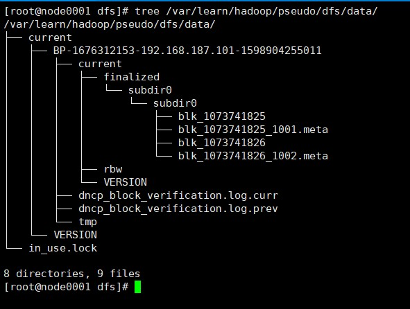
  - 关闭：stop-dfs.sh

### 2.2.10. 相关思考

- 列出 Hadoop 集群的 Hadoop 守护进程和相关的角色
- 为什么 hadoop 的 namenode 基于内存存储？他的优势和弊端是什么？
- hadoop namenode 持久化操作的流程
- 阐述分布式架构计算向数据移动的必要性
- 熟练完成伪分布式 hadoop 的安装，测试创建目录、上传、删除文件
- 测试角色进程版本号不一致现象并给出解决方案。

## 2.3. 分布式集群

### 2.3.1. hadoop1.0 集群搭建

| 节点名称 | NN  | DN  | SN  |
| :------: | :-: | :-: | :-: |
| node0001 | \*  |     |     |
| node0002 |     | \*  | \*  |
| node0003 |     | \*  |     |
| node0004 |     | \*  |     |

- 搭建基础 linux 集群
  > 安全机制 hosts 防火墙等设置
- 设置成相同时间：`date -s "2020-09-01 15:32:00"`
- 免密钥操作
  > NN 要开启其他节点的角色进程，需要权限
  - scp .ssh/authorized_keys root@node0002:.ssh/node0001.pub
    > 该操作是对免密码登录服务器进行记录。因为可能不止只有一个服务器可以免密码，所以不能直接覆盖 authorized_keys
  - cat .ssh/node0001.pub >> .ssh/authorized_keys
- 修改 core-site.xml
  ```xml
  <configuration>
      <property>
          <name>fs.defaultFS</name>
          <value>hdfs://node0001:9000</value>
          <!-- 全分布式NameNode主节点角色进程信息 -->
      </property>
      <property>
          <name>hadoop.tmp.dir</name>
          <value>/var/learn/hadoop/full</value>
          <!-- 全分布式部署相关文件存储位置 -->
      </property>
  </configuration>
  ```
- 修改 hdfs-site.xml
  ```xml
    <configuration>
      <property>
          <name>dfs.replication</name>
          <value>2</value>
          <!-- 因为只有三个从节点，所以为了查看副本放置策略，这里设置成两个 -->
      </property>
      <property>
          <name>dfs.namenode.secondary.http-address</name>
          <value>node0002:50090</value>
          <!-- SecondNameNode单独配置到另一台上 -->
          <!-- node0002即是SecondeNameNode，也是从节点 -->
      </property>
    </configuration>
  ```
- 修改 slaves
  ```
  node0002
  node0003
  node0004
  ```
- 将 hadoop 发送(`scp`)到其他三个节点上
- 将/etc/profile 分发到其他三个节点上（也可以自己手动改），再 souce 重新加载
- `hdfs namenode -format` 格式化 NameNode 节点
- 启动`start-dfs.sh`
  > 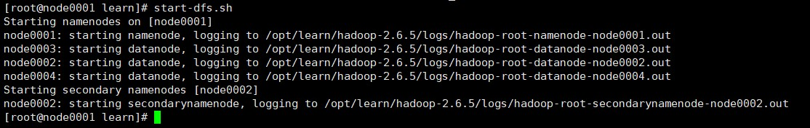
  > 启动提示，启动 NameNode 时，会自动启动 DataNode 和 SecondNameNode。以及日志文件位置。出现问题后，就去查日志
  > 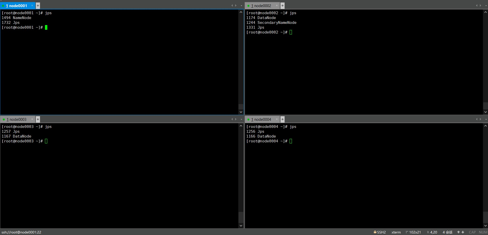
  > 角色进程
- 创建 hdfs 的文件夹`hdfs dfs mkdir -p /user/root`
- 设置测试文件`for i in $(seq 100000);do echo "hello hadoop $i" >> test.txt;done`
- 以指定块大小发放文件 `hdfs dfs -D dfs.blocksize=1048576 -put test.txt`
  > 属性名可以查看官方文档中的 hdfs-defult.xml<br>
  > 目的路径不写的话默认放到/user/root 路径(如果不提前创建的话会报错)<br>
- 查看块分布
  > 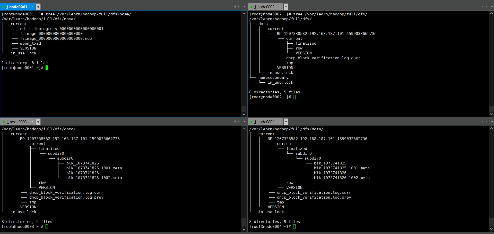
  > 块分布，块 1 放在了 node0003,node0004。块 2 放在了 node0003,node0004（可以能 node0002，node0004 等，与是否为同一个文件无关）。
- `vi + /var/learn/hadoop/full/dfs/data/current/BP-1207338582-192.168.187.101-1599033662736/current/finalized/subdir0/subdir0/blk_1073741825`
  > 查看块内容，可以发现按字节切割，会把行拆开
  > 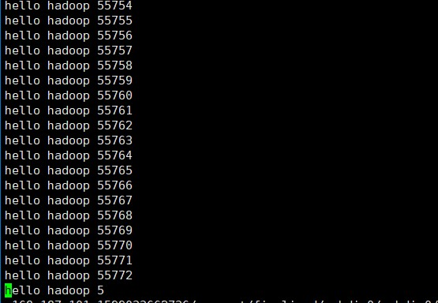 > **以后讲内部代码时会讲解决办法，解决办法在当时说**

### 2.3.2. hadoop2.0 及 导入

- Hadoop 2.0 产生背景

  - Hadoop 1.0 中 HDFS 和 MapReduce 在高可用、扩展性等方面存在问题
  - HDFS 存在的问题(2 个)
    - NameNode 单点故障，难以应用于在线场景。解决方式：High Availability(高可用)
      > 主备模型。<br>
      > 主备不同时工作原因：面临问题：**split brain(脑裂)**
    - NameNode 压力过大，且内存受限，影扩展性。解决方式：Federation(联邦)
      > NameNode 内存优先，无法充分使用所有 DataNode 服务器<br>
      > 联邦： 多个 NameNode 共同提供服务
  - MapReduce 存在的问题响系统
    - JobTracker 访问压力大，影响系统扩展性
    - 难以支持除 MapReduce 之外的计算框架，比如 Spark、Storm 等

- Hadoop 1.x 与 Hadoop 2.x

  > 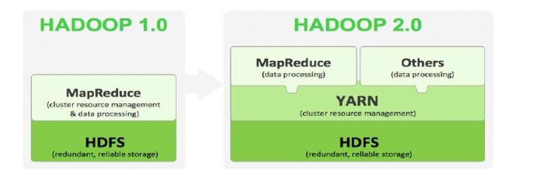

- Hadoop 2.x 由 HDFS、MapReduce 和 YARN 三个分支构成；

  - HDFS：NN Federation（联邦）、HA；
    - 2.X:只支持 2 个节点 HA，3.0 实现了一主多从，官方推荐一主两备
  - MapReduce：运行在 YARN 上的 MR；
    - 离线计算，基于磁盘 I/O 计算
  - YARN：资源管理系统

- HDFS 2.x
  - 解决 HDFS 1.0 中单点故障和内存受限问题。
  - 解决单点故障
    - HDFS HA：通过主备 NameNode 解决
    - 如果主 NameNode 发生故障，则切换到备 NameNode 上
  - 解决内存受限问题
    - HDFS Federation(联邦)
    - 水平扩展，支持多个 NameNode；
    - （2）每个 NameNode 分管一部分目录；
    - （1）所有 NameNode 共享所有 DataNode 存储资源
  - 2.x 仅是架构上发生了变化，使用方式不变
  - 对 HDFS 使用者透明
  - HDFS 1.x 中的命令和 API 仍可以使用

### 2.3.3. 高可用(ZK+JN)

> 使用，主备模型。主要看主备间的数据同步问题

- 主备注意点：

  - hadoop2.0 中 SecondNameNode 就用不上了
  - 备 NameNode(NN Standby) 用来做 edits 和 fsimage 的合并

- HDFS 2.0 HA

  > ppt 总结

  - 主备 NameNode
  - 解决单点故障（属性，位置）
    - 主 NameNode 对外提供服务，备 NameNode 同步主 NameNode 元数据，以待切换
    - 所有 DataNode 同时向两个 NameNode 汇报数据块信息（位置）
    - JN 集群（属性）
    - standby：备，完成了 edits.log 文件的合并产生新的 image，推送回 ANN
  - 两种切换选择
    - 手动切换：通过命令实现主备之间的切换，可以用 HDFS 升级等场合
    - 自动切换：基于 Zookeeper 实现
  - 基于 Zookeeper 自动切换方案
  - ZooKeeper Failover Controller：监控 NameNode 健康状态，
  - 并向 Zookeeper 注册 NameNode
  - NameNode 挂掉后，ZKFC 为 NameNode 竞争锁，获得 ZKFC 锁的 NameNode 变为 active

- hadoop2.0 高可用架构模型图
  > 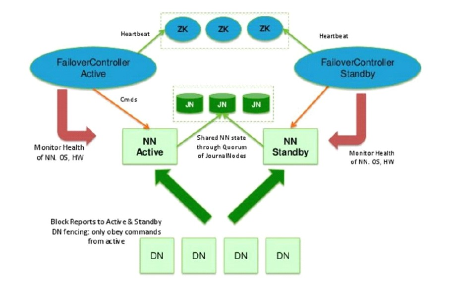 > 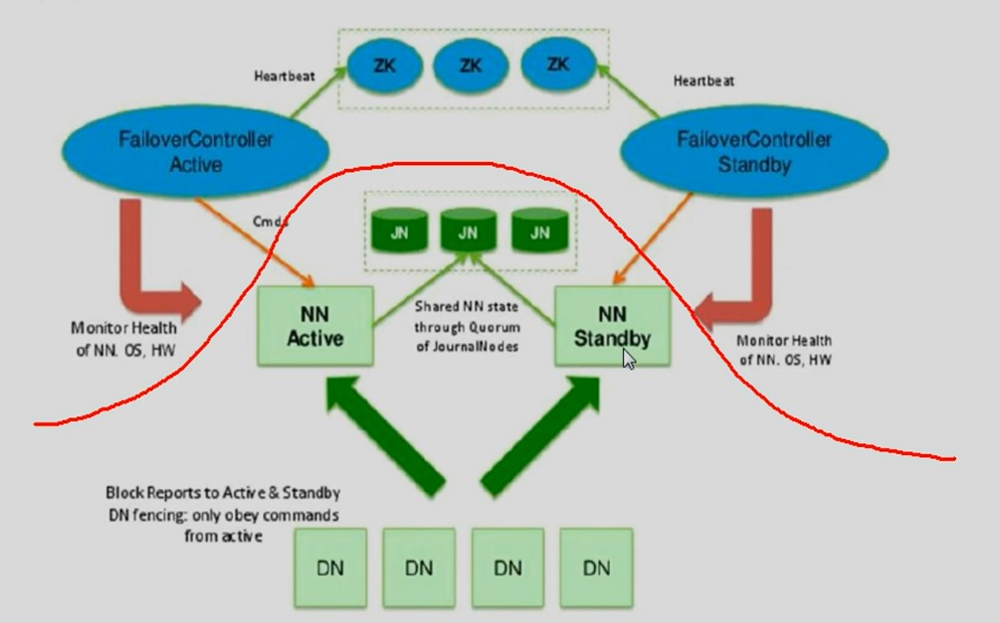
  - 作用:
    - 上半部分完成主备节点间的自动切换
      - 通过 zookeeper(分布式协调系统)
    - 下部分做到了数据同步
  - 同 lvs，两个主备 NN 必须时刻保持数据同步
    - 数据类型：
      - 动态数据：块位置信息
        > DN 时刻向 NN 主动汇报的信息，不会持久化到文件当中
      - 静态数据：块偏移量，大小，权限
    - 数据同步方式：
      - 动态数据：单一汇报变成多汇报
      - 静态数据：
        - 早期：nfs:network filesystem(网络同步服务器)，将 edits 文件放到另一台服务器上，主备公用。
          > 缺陷：nfs 依旧有单点故障问题
        - 现在使用：**JournalNode(日志节点)集群**。多台 JN 共同保存 edits 日志数据，JN 间保持同步。主 NN 往 JN 集群中写，备 NN 从 JN 中读
          - JournalNode 数量必须为奇数且大于等于 3
          - 过半机制：最多容忍一半及以下台服务器出现故障。原因之后再讲
  - 主备切换：
    - 手动切换：
      - 不使用 zookeeper 集群
      - 数据同步会自动进行，但当主服务器挂掉，必须手动切换，或通过脚本实现自动切换
    - 自动切换：
      > zookeeper:分布式协调系统。底层 java，开源。
      > 底层基于 zab 协议。来源于 1990 年 paxos 论文：基于消息一致性算法的论文
      - 使用 zookeeper 集群。自动完成主备节点的切换
      - zookeeper 基本原理:
        > 一主多从架构<br>
        > 看文档（高可用配置那里）。<br>
        > 四大机制：register(注册)，watchEvent(监听事件),callback(客户端函数的回调,客户端是 zkfc 的函数),
        - zookeeper 在每个 NN 上开启一个 FailoverController(故障转移控制,缩写：zkfc)进程。
          > [组件详解](https://blog.csdn.net/bocai8058/article/details/78870451)
          - elector 组件:每个 FailoverController 进程中有 elector(选举)进程，都向 zookeeper 集群申请作为主节点（register，注册）。最先进行注册的节点会作为主节点（注册顺序可以通过代码控制）。
          - HealthMonitor:健康检查组件，检查 NN 健康状态
        - zookeeper 中为主 NN 创建一个节点路径`znode`，该路径之下，会有节点的注册信息
        - 备 NN 会委托 zookeeper 检查 zookeeper 观察主 NN 所发生的事件
        - 如果 NN 出现故障，zookeeper 告知备 NN
        - 备 NN 会调用回调函数，强制让主 NN 变为 Standby 状态，再自行将 Standby 转为 active 状态
          > 也就是说 zookeeper 只起到消息通知作用<br>
          > 就算主 NN 故障了，也不能直接把备 NN 提升为 active，否则会出现 split brain 问题

### 2.3.4. 联邦

> 搭建不作为重点，普通企业 NameNode 很少需要搭建联邦

- 目的：
  - 通过多个 namenode/namespace 把元数据的存储和管理分散到多个节点中，使到 namenode/namespace 可以通过增加机器来进行水平扩展。
  - 能把单个 namenode 的负载分散到多个节点中，在 HDFS 数据规模较大的时候不会也降低 HDFS 的性能。可以通过多个 namespace 来隔离不同类型的应用，把不同类型应用的 HDFS 元数据的存储和管理分派到不同的 namenode 中。

**※待做**

### 2.3.5. 高可用集群搭建

#### 2.3.5.1. 搭建目标

> 多看官方文档

| 节点名称 | NN-1 | NN-2 | DN  | ZK  | ZKFC |  JN  |
| :------: | :--: | :--: | :-: | :-: | :--: | :--: |
| node0001 |  \*  |      |     |     |  \*  |  \*  |
| node0002 |      |  \*  | \*  | \*  |  \*  |  \*  |
| node0003 |      |      | \*  | \*  |      | \*　 |
| node0004 |      |      | \*  | \*  |      |      |

> 其中 zookeeper 的搭建和别的集群没有任何关系，搭建在哪里都行（可以查看上面那个架构图）。但 ZKFC 必须要搭建在两个主备 NN 上

> ZKFC 是 NN 中的进程，通过 hdfs 命令格式化和开启

> journalnode 需要在 hadoop 配置文件中指明，位置随便

> journalnode 和 zookeeper 要先于 DN 和 NN 启动

#### 2.3.5.2. 搭建过程

> 推荐仔细看看文档，都有

**在基础集群上进行搭建**

- node0001 和 node0002 间要进行主备切换，所以互相要可以免密钥登录。进行免密钥设置
- hdfs-site.xml

  ```xml
  <configuration>
    <property>
      <name>dfs.replication</name>
      <value>2</value>
    </property>
    <property>
      <name>dfs.nameservices</name>
      <!-- namenode services缩写 -->
      <value>mycluster</value>
      <!-- 一对主备NN的逻辑名称 -->
    </property>
    <property>
      <name>dfs.ha.namenodes.mycluster</name>
      <value>nn1,nn2</value>
      <!-- mycluster对应的两个NN的逻辑名称 -->
    </property>
     <property>
      <name>dfs.namenode.rpc-address.mycluster.nn1</name>
      <!-- rpc:remote procedure call.类似java中的rmi -->
      <value>node0001:8020</value>
      <!-- nn1所在ip:port -->
    </property>
    <property>
      <name>dfs.namenode.rpc-address.mycluster.nn2</name>
      <value>node0002:8020</value>
      <!-- nn2所在ip:port -->
    </property>
    <property>
      <name>dfs.namenode.http-address.mycluster.nn1</name>
      <value>node0001:50070</value>
      <!-- nn1对应图形管理界面ip:port -->
    </property>
    <property>
      <name>dfs.namenode.http-address.mycluster.nn2</name>
      <value>node0002:50070</value>
      <!-- nn2对应图形管理界面ip:port -->
    </property>
    <property>
      <name>dfs.namenode.shared.edits.dir</name>
      <value>qjournal://node0001:8485;node0002:8485;node0003:8485/mycluster</value>
      <!-- mycluster主备NN 使用的 JN集群对应服务器 -->
    </property>
    <property>
      <name>dfs.client.failover.proxy.provider.mycluster</name>
      <value>org.apache.hadoop.hdfs.server.namenode.ha.ConfiguredFailoverProxyProvider</value>
      <!-- 故障转移的代理类,这里直接抄上去就行了 -->
    </property>

    <!-- 下面两个是为了避免当主NN发生故障可能产生的splite-brain情况 -->
    <!-- 通过ssh的方式，也可以配置shell的方式 -->
    <property>
      <name>dfs.ha.fencing.methods</name>
      <value>sshfence</value>
      <!-- ssh远程登录进行隔离。standby登录active -->
    </property>
    <property>
      <name>dfs.ha.fencing.ssh.private-key-files</name>
      <value>/root/.ssh/id_dsa</value>
      <!-- 私钥文件位置。私钥作用？？ -->
    </property>

    <property>
      <name>dfs.journalnode.edits.dir</name>
      <value>/var/learn/hadoop/ha/journalnode</value>
      <!-- journalnode存储的绝对路径位置，JN间会同步，都放置在同一个位置 -->
    </property>
  </configuration>
  ```

- core-site.xml
  ```xml
  <configuration>
    <property>
        <name>fs.defaultFS</name>
        <value>hdfs://mycluster</value>
    </property>
    <property>
        <name>hadoop.tmp.dir</name>
        <value>/var/learn/hadoop/ha</value>
    </property>
  </configuration>
  ```
- slave:照旧

- (现在整个系统配置好了高可用，已经可以跑起来了，只不过需要手动切换主备。zookeeper 是游离于整个系统之外，他的启动和关闭和整个系统没关系，仅仅根据需要进行配置)

  - 如果现在想启动，跳过 zookeeper 配置直接到启动即可

- zookeeper 配置

  - 添加 zookeeper
    - hdfs-site.xml：
      ```xml
      <!-- 添加 -->
      <property>
        <name>dfs.ha.automatic-failover.enabled</name>
        <value>true</value>
        <!-- 开启自动故障转移 -->
      </property>
      ```
    - core-site.xml
      ```xml
      <property>
        <name>ha.zookeeper.quorum</name>
        <value>node0002:2181,node0003:2181,node0004:2181</value>
        <!-- 指明zookeeper集群服务器位置 -->
      </property>
      ```
  - 分发 hadoop 配置文件到其他节点
  - zookeeper 解压到 /opt/learn/
  - 修改 zookeeper 配置文件
    - mv zoo_sample.cfg zoo.cfg
    - vi zoo.cfg
    - 修改：`dataDir=/var/learn/zk`
    - 结尾添加：
      > zookeeper 集群在搭建一开始就需要提供集群服务器的信息，并为服务器编号 serverid<br>
      > zookeeper 是一主多从架构，zookeeper 的编号与选举机制有关。同时启动的情况下，最大编号服务器会作为主服务器（其他因素之后讲）
      ```
      <!-- 2888：主从间通讯接口 -->
      <!-- 3888：主挂断后，选举机制采用的通讯端口 -->
      server.1=node0002:2888:3888
      server.2=node0003:2888:3888
      server.3=node0004:2888:3888
      ```
  - 讲 zookeeper 分发到其他节点/opt/learn
  - 创建编号目录
    > 每台服务器在启动时会读取该文件获得自己编号
    - node0002:`mkdir -p /var/learn/zk` `echo 1 > /var/learn/zk/myid`
    - node0003:`mkdir -p /var/learn/zk` `echo 2 > /var/learn/zk/myid`
    - node0004:`mkdir -p /var/learn/zk` `echo 3 > /var/learn/zk/myid`
  - zookeeper 环境变量配置
    ```shell
    export ZOOKEEPER_HOME=/opt/learn/zookeeper-3.4.6
    PATH=$PATH:$ZOOKEEPER_HOME/bin
    ```
  - 分发 profile
  - source /etc/profile
  - 每台都运行`zkServer.sh start`来启动
    > 如果一台一台启动，第一台启动时，zookeeper 不会运行。第二台启动时，两台服务器会同时开始运行(过半原则)，同时两台中较大 id 的服务器会作为 leader，其他会作为 follower
    - jps 查看
      - QuorumPeerMain 进程
    - zkServer.sh status 查看
  - ZKFC 进程在主备 NN 上会随着 hadoop 启动而启动（也可以手动单独启动）(查文档)

- 首次启动
  > 其实也可以将启动和结束写成一个脚本。之后有时间写下
  - zookeeper 已经启动了
  - journalnode启动
    > 目的：提前启动journalnode，给NN2同步NN1的格式化信息（如果NN2额外格式化，id会有区别）<br>
    > 过程：启动journalnode，启动主namenode(不启动hadoop),格式化主namenode(edits放入journalnode)，备NN通过journalnode同步主NN的格式化信息<br>
    > 所以再次启动时，就不用提前启动journalnode了。start-dfs.sh会自动启动journalnode
    - node0001 启动 journalnode:`hadoop-daemon.sh start journalnode`
    - node0002 启动 journalnode:`hadoop-daemon.sh start journalnode`
    - node0003 启动 journalnode:`hadoop-daemon.sh start journalnode`
  - NN-1(node0001)格式化：`hdfs namenode -format`
    > 格式化namenode时，也会将journalnode格式化
  - 启动 NN-1 角色进程 `hadoop-daemon.sh start namenode`
    > `start-dfs.sh`是开启所有服务器的角色进程，包括 ZKFC
    > 该操作是为了 NN-2 和 NN-1 间能够进行信息传递，之后要拷贝格式化后得到的文件（类似：NN-1 作为 S,NN-2 作为 C）
  - NN-2 同步 NN-1 的信息：`hdfs namenode -bootstrapStandby`
    > NN-2 不要格式化，否则两节点 id 不一致，无法构成一个集群
  - node0001: 在zookeeper集群中创建目录。hdfs zkfc -formatZK
  - zkCli.sh，进入 zookeeper 客户端交互（哪个 ZK 节点都行）
    - help 查看命令列表
    - ls / 查看根目录
    - ls /hadoop-ha
  - node0001:`start-dfs.sh`启动集群
    > 其他可以免密登录的节点来启动也行<br>
    > NN-1 已经启动，不会重复启动<br>
    > zkfc会在此时启动
  - zkCli.sh，进入 zookeeper 客户端交互
    - ls / 查看根目录
    - ls /hadoop-ha
    - get /hadoop-ha/mycluster/ActiveBreadCrumd
    - get /hadoop-ha/mycluster/ActiveStandyElectorLock
      > 只会处于 active 节点(node0001)的信息会在 zookeeper 完成注册
  - 浏览器进入 node0001:50070 node0002:50070

- 测试
  - 1
    - node0006:`hadoop-daemon.sh stop namenode`
    - 浏览器进入 node0002:50070
      > 会发现自动故障转移切换
    - zkCli.sh，进入 zookeeper 客户端交互
      - get /hadoop-ha/mycluster/ActiveBreadCrumd
      - get /hadoop-ha/mycluster/ActiveStandyElectorLock
        > 只会处于 active 节点(node0002)的信息会在 zookeeper 完成注册
    - node0006 重新启动角色进程:`hadoop-daemon.sh start namenode`
      > node0006 会作为备
  - 2
    - node0007:`hadoop-daemon.sh stop zkfc`
    - node0007 变为备
    - node0006 变为主

- 关闭
  - 关闭除zookeeper外的所有进程：`stop-dfs.sh`
  - 关闭zookeeper:三个zookeeper服务器执行`zkServer.sh stop`

- 再次启动：
  - 启动三个zookeeper服务端进程
  - start-dfs.sh

## 2.4. 分布式计算框架 MR

> 计算向数据移动

## 2.5. 体系结构

## 2.6. 安装

## 2.7. shell

## 2.8. API
