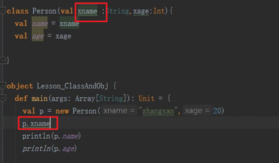
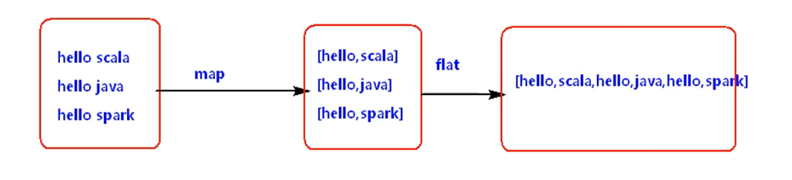

spark1.6 -- scala2.10
spark2.x -- scala2.11

# 类和对象

- 1.Scala object相当于java中的单例，object中定义的全是静态的,相当于java中的工具类，Object不可以传参，对象要传参，使用apply方法。
- 2.Scala中定义变量使用var，定义常量使用val ,变量可变，常量不可变.变量和常量类型可以省略不写，会自动推断。
- 3.Scala中每行后面都会有分号自动推断机制，不用显式写出“;”
- 4.建议在Scala中命名使用驼峰命名法
- 5.Scala类中可以传参，传参一定要指定类型，有了参数就有了默认了构造。类中的属性默认有getter和setter方法
- 6.类中重写构造时，构造中第一行必须先调用默认的构造 。def this(....){....}
- 7.Scala中当new class 时，类中除了方法不执行【除了构造方法】，其他都执行。
- 8.在同一个scala文件中，class名称和Object名称一样时，这个类叫做个对象的伴生类，这个对象叫做这个类的伴生对象，他们之间可以互相访问私有变量。
-	9.如果类的传参用 val或者var进行声明，就可以通过类的实例访问。但是基本不会用这种方式。
  >  

```scala
class Person(xname :String,xage:Int){
  private val name = xname
  var age = xage
  var gender = 'M'

  // * 7.Scala中当new class 时，类中除了方法不执行【除了构造方法】，其他都执行。
  println("******* Person Class *********")

  // 注意，没有等号
  def this(yname:String,yage:Int,ygender:Char){
    this(yname,yage)
    this.gender = ygender
  }

  def  sayName() = {
  println("hello world..."+Lesson_ClassAndObj.name)
  }
  println("====== Person Class =======")
}

object Person{
  println("####### Lesson_ClassAndObj Object #####")
  val name = "wangwu" // 静态变量

  // 如果想给object传参，就会传到apply中。如果没有apply就会报错
  def apply(i:Int) = {
      println("Score is "+i)
  }
  // apply 的重载
  def apply(i:Int,s:String) = {
      println("name is "+s+",score is "+i)
  }

  def main(args: Array[String]): Unit = {

    val p = new Person("zhangsan",20)
    println(p.name)

    println(p.gender)
    val p1=new Person("diaochan",18,'F')
    println(p1.gender)
    p.age = 200
    println(p.name)
    println(p.age)
    p.sayName()

    val a = 100
    var b = 200
    b = 300
    println(b)
  }
}
  ```

# 简单语法

```scala
object Lesson_ClassAndObj {

  def main(args: Array[String]): Unit = {

    /**
      * while
      * do...while...
      */
    var i = 0
    do{
    // 类似于linux
      println(s" 第 $i 次求婚。。。")
      i += 1
    }while(i<100)

    while(i<100){
      println(s" 第 $i 次求婚。。。")
        i = i+1
      i += 1
    }

    /**
      * for
      */
    val r = 1.to(10,2)
    val r1 = 1 until (10,3)
    println(r)
    println(r1)
    // <-右边是一个数组
    for(i <- 1 to 10){
      println(i)
    }

    //小九九
    for( i<- 1 until  10){
      for(j <- 1 until 10){
        if(i>=j){
          print(i+"*"+j+"="+i*j+"\t")
        }
        if(i==j){
          println()
        }
      }
    }

    for( i<- 1 until  10;j <- 1 until 10){
        if(i>=j){
          print(i+"*"+j+"="+i*j+"\t")
        }
        if(i==j){
          println()
        }
    }

    // 筛选条件可以通过分号或者空格隔开
    for(i <- 1 to 1000  if(i>500) if(i%2==0)){
      println(i)
    }

    val result = for(i <- 1 to 100  if(i>50) if(i%2==0)) yield  i  // yield 。回想python的yield。
    println(result)

  /**
    * if...else...
    */
    val age = 20
    if(age<=20){
      println("age <=20")
    }else if(age>20&&age<=30){
      println("20<20<=30")
    }else{
      println("age>30")
    }
}
```

# 方法定义

- 普通方法(scala中方法和函数基本相等)
  - 1).方法体中最后返回值可以使用return,如果使用了return,那么方法体的返回值类型一定要指定
  - 2).如果方法体中没有return，默认将方法体中最后一行计算的结果当做返回值返回。方法体的返回值类型可以省略，会自动推断返回值的类型
  - 3).定义方法传入的参数一定要指定类型
  - 4).方法的方法体如果可以一行搞定，那么方法体的“{...}”可以省略
  - 5).如果定义方法时，省略了方法名称和方法体之间的 = ，那么无论方法体最后一行计算的结果是什么，都会被丢弃，返回Unit
  - 6).def 定义方法
- 递归函数
- 带有默认值的函数
- 可变长参数函数
- 匿名函数
- 嵌套函数
- 偏应用函数
- 高阶函数
- 柯里化（js中也有）

```scala
import java.util.Date

object Lesson_Function {
  def main(args: Array[String]): Unit = {
    /**
    方法体中最后返回值可以使用return,如果使用了return,那么方法体的返回值类型一定要指定
    返回类型不需要指定，会自动进行推断
      */
    def max(a:Int,b:Int)={
      if(a>b){
        a
      }else{
        b
      }
    }

    // 方法的方法体如果可以一行搞定，那么方法体的“{...}”可以省略
    def max(a:Int,b:Int) =  if(a>b)  a else b

    println(max(100,20))

    /**
    * 2.递归方法
    *   递归方法要显式的声明函数的返回值类型，因为无法推断每次递归的结果类型。
    */
    def fun(num:Int):Int= {
      if(num==1){
        1
      }else{
        num*fun(num-1)
      }
    }
    println(fun(5))

    /**
    * 3.参数有默认值的方法
    */
    def fun(a:Int=10,b:Int=20) = {
      a+b
    }

    println(fun(30))
    println(fun(b=200))

    /***
    * 4.可变长参数的方法
    */
    // s是数组
    def fun(s:String*) = {
        for(elem<-s){
          println(elem)
        }
    }

    def fun(s:String*) = {
      s.foreach(elem=>{ // 匿名函数，函数式编程
        println(elem)
      })
    }

    def fun(s:String*) = {
      s.foreach(println(_))// 只调用一次的参数，可以简化为 _ 表示
    }

    def fun(s:String*) = {
      s.foreach(println)// 当只有一个参数，且只调用一次时，可以直接传入方法名称
    }
    fun("hello","a","b","c")

    /**
    * 5.匿名函数
    *  ()=>{} 就是匿名函数，多用于方法的参数是函数时，常用匿名函数
    */
    def fun1(a:Int,b:Int) = {
      a+b
    }
    // 回想js中多种函数的定义方式
    def fun = (a:Int,b:Int)=>{ // 把匿名函数赋值给一个变量
        a+b
    }

    // 也可以自己把类型写出来，不让系统推断
    def fun :(Int,Int)=>Int = (a:Int,b:Int)=>{ // 把匿名函数赋值给一个变量
        a+b
    }

    println(fun(100,200))

    // 系统推断为Unit。就是void
    var fun1: String => Unit = (s: String) => {
      println(s)
    }
    fun1("hello")

    /**
    * 6.嵌套方法
    *   方法中定义方法
    */
    def fun(num:Int) = {

      def fun1(a:Int):Int = {
        if(a==1){
          1
        }else{
          a*fun1(a-1)
        }
      }

      fun1(num)
    }

    println(fun(5))

    /**
    * 7.偏应用函数
    *   某些情况下，方法中参数非常多，调用这个方法非常频繁，每次调用只有固定的某个参数变化，其他都不变，可以定义偏应用来实现
    *
    *   js中的闭包？？
    */
    def showLog(date:Date,log:String) ={
      println(s"date is $date   ,  log is $log")
    }
    val date = new Date()
    showLog(date,"a")
    showLog(date,"b")
    showLog(date,"c")

    def fun = showLog(date,_:String)
    fun("aaa")
    fun("bbb")
    fun("ccc")

    /**
    *  8.高阶函数
    *    1).方法的参数是函数
    *    2).方法的返回是函数  <要显式的写出方法的返回值类型,加 _ 就可以不显示的声明方法的返回值类型>
    *    3).方法的参数和返回都是函数
    */
    // 1)方法的参数是函数
    def fun(a:Int,b:Int):Int = {
      a+b
    }

    // _ 可以把方法转换为显示定义的方法引用
    val fun_back: (Int, Int) => Int = fun _

    // 通过 f:(parmtype,..)=>resulttype 来表示参数是一个函数。f为函数名称，也可以改
    def fun1(f:(Int,Int)=>Int,s:String):String = {
      val i: Int = f(100,200)
      i+"#"+s
    }

    val result = fun1(fun,"scala")
    println(result)

    // 使用匿名函数传参
    val result = fun1((a:Int,b:Int)=>{a*b},"scala")
    println(result)


    // 2)方法的返回是函数
    // 一般情况下必须显示写出返回函数的类型。或者使用 _
    def fun(s:String):(String,String)=>String = {
      def fun1(s1:String,s2:String): String= {
          s1+"~"+s2+"#"+s
      }
      fun1
    }
    println(fun("a")("b","c"))

    // 此处没有显示写出返回值类型。主要是 _ 的作用
    def fun(s:String):(String,String)=>String = {
      def fun1(s1:String,s2:String): String= {
          s1+"~"+s2+"#"+s
      }
      fun1 _ // 表示强制将方法返回。
    }
    println(fun("a")("b","c"))


    // 3)方法的参数和返回都是函数
    def fun(ddd:(Int,Int)=>Int):(String,String)=>String = {
      val i: Int = ddd(1,2)
      def fun1(s1:String,s2:String):String = {
        s1+"@"+s2+"*"+i
      }
      fun1
    }
    println(fun((a,b)=>{a+b})("hello","world"))

    /**
    * 9.柯里化函数
    * 就是高阶函数第二种的简化写法
    * 后面隐式转换用得到
    */
    def fun(a:Int,b:Int)(c:Int,d:Int)={
      a+b+c+d
    }
    println(fun(1,2)(3,4))
  }
}
```


# 字符串

**字符串就是java中的字符串**

```scala
package com.bjsxt.scala

object Lesson_String {
  def main(args: Array[String]): Unit = {
    val s = "jsxbt"
    val s1 = "BJSXT"

    println(s.indexOf(98))
    println(s.equals(s1))
    println(s.equalsIgnoreCase(s1))
  }
}
```

# 集合

Array,List,Set,Map 都有可变和不可变的定义方式。默认都是不肯变的

## Array

- 不可变数组
  ```scala
  object Lesson_Array {
    def main(args: Array[String]): Unit = {

      // [] 中的相当于泛型
      // 创建1：带初始化，创建一维数组(不可变)
      val arr = Array[String]("a","b","c","d")
      
      // 遍历array
      arr.foreach(println)
      for(elem<-arr){
        println(elem)
      }

      // 创建2：指定长度创建一维数组(不可变)
      val arr1 = new Array[Int](3)
      arr1(0) = 100
      arr1(1) = 200
      arr1(2) = 300

      // 创建3 二维数组
      val array = new Array[Array[Int]](3)
      array(0) = Array[Int](1,2,3)
      array(1) = Array[Int](4,5,6)
      array(2) = Array[Int](7,8,9)

      // 遍历二维array
      array.foreach(arr=>{arr.foreach(println)})
      for (arr<-array;elem<-arr){// 双重for循环简化写法。前面有说
          println(elem)
      }

      // 常用方法
      val array: Array[String] = Array.fill(5)("hello")// 长度为5，所有元素都为"hello"
      array.foreach(println)

      val arrays: Array[String] = Array.concat(arr,arr1) // 连接
      arrays.foreach(println)
    }
  }
  ```
- 可变数组
  ```scala
  // 可变数组
  import scala.collection.mutable.ArrayBuffer

  val arr =ArrayBuffer[Int](1,2,3)
  arr.append(7,8,9)// 往后追加
  arr.+=(4)// 往后追加
  arr.+=:(100)// 往前追加
  ```

## list

- 不可变类型
  ```scala
  import scala.collection.mutable.ListBuffer

  object Lesson_List {
    def main(args: Array[String]): Unit = {

      val list = List[String]("hello scala","hello java","hello spark","a","abc")

      // 各种函数式接口

      // map方式
      val result: List[Array[String]] = list.map(s => {
        s.split(" ")
      })

      // 会将多个数组进行扁平化
      val result: List[String] = list.flatMap(s=>{s.split(" ")})

      // count 计算
      val i: Int = list.count(s => {
        s.length < 4
      })

      // 过滤器。只会留下返回true的
      val result: List[String] = list.filter(s => {
        "hello scala".equals(s)
      })

      val list = List[Int](1,2,3)
      for(elem<-list){
        println(elem)
      }
      list.foreach(println)
    }
  }
  ```
- 可变list
  ```scala
  import scala.collection.mutable.ListBuffer
  val list = ListBuffer[Int](1,2,3)
  list.append(4,5,6)
  list.+=(100)
  list.+=:(100)
  list.foreach(println)
  ```
- map和flatmap
  >  

## Set

- 不可变set
  ```scala
  package com.bjsxt.scala
  object Lesson_Set {
    def main(args: Array[String]): Unit = {
      val set = Set[Int](1,2,3,4)
      val set1 = Set[Int](3,4,5,6)

      // 差集 set1-set
      val result: Set[Int] = set1.diff(set)
      result.foreach(println)
      // 操作符操作，差集
      val result = set &~ set1

      // 合集
      val result: Set[Int] = set.intersect(set1)
      result.foreach(println)
      // 操作符操作。和集
      val result = set & set1
      result.foreach(println)

      // 过滤器
      val ints: Set[Int] = set.filter(elem => {
        elem >= 2
      })
      ints.foreach(println)

    }
  }
  ```
- 即定义可变，又定义不可变
  > 可变和不可变Set类名都是Set
  - 多次import进行覆盖
    ```scala
    import scala.collection.mutable.Set
    val set = Set()
    import scala.collection.immutable.Set
    val set = Set()
    ```
  - 指定包名
    ```scala
    import scala.collection.mutable
    import scala.collection.immutable

    val set = mutable.Set[Int](1,2,3)// 可变
    set.+(100)// 会返回加上元素后的一个新集合
    set.+=(100)// 会在现有的set上操作
    set.foreach(println)
    val set1 = immutable.Set[String]("a","b")// 不可变
    ```

## Map

没有 new Map

- 不可变 
  ```scala
  package com.bjsxt.scala
  object Lesson_Map {
    def main(args: Array[String]): Unit = {
      import scala.collection.mutable.Map

      // kv有两种写法，->或者括号
      val map = Map[String,Int]("a"->100,"b"->200,("c",300),("c",400))
      map.foreach(println) // 获取每个k-v，其实也就是元组类型 

      // java中在1.8后也有了Option类
      val value = map.get("a") // 返回Option类型的子类，Some(100)
      val value = map.get("aa") // 返回Option类型的子类，None
      val value = map.get("aa").getOrElse("no value")// 如果是Some，就返回值。如果是None，就返回"no value"
      println(value)

      // 获取map的key
      val keys: Iterable[String] = map.keys
      // 打印key-value
      keys.foreach(key=>{
        val value = map.get(key).get
        println(s"key = $key ,value = $value")
      })

      // 获取map的value
      val values: Iterable[Int] = map.values
      values.foreach(println)

      // map的合并，返回新的map
      val map1 = Map[String,Int](("a",1),("b",2),("c",3),("d",4))
      val map2 = Map[String,Int](("a",100),("b",2),("c",300),("e",500))
      val result: Map[String, Int] = map1.++:(map2)// map的合并。map1会覆盖map2
      result.foreach(println)
    }
  }
  ```
- 想要既定义可变map又定义不可变map
  - 多次import进行覆盖
  - 指定包名
  ```scala
  // 导入Map
  import scala.colletion.mutable.Map
  val map = Map[String,Int]()
  map.put("a",100)
  map.put("b",200)
  map.foreach(println)
  val result: mutable.Map[String, Int] = map.filter(tp => {
    val key = tp._1
    val value = tp._2
    value == 200
  })
  result.foreach(println)
  ```

## Tuple


