# 1. Spark core

## 1.1. 生态系统

- spark 和 hadoop
  ```
  都是分布式计算框架，Spark基于内存，MR基于HDFS。
  Spark处理数据的能力一般是MR的十倍以上，
  Spark中除了基于内存计算外，还有DAG有向无环图来切分任务的执行先后顺序。

  但 mapreduce 无法很好得完成迭代计算和反复读写工作子集,IO开销太大;序列化，反序列化开销太大
  mapreduce是hadoop生态系统的缺陷，但其他组件依旧会用，尤其是hdfs
  ```
- spark 和mapreduce
  > 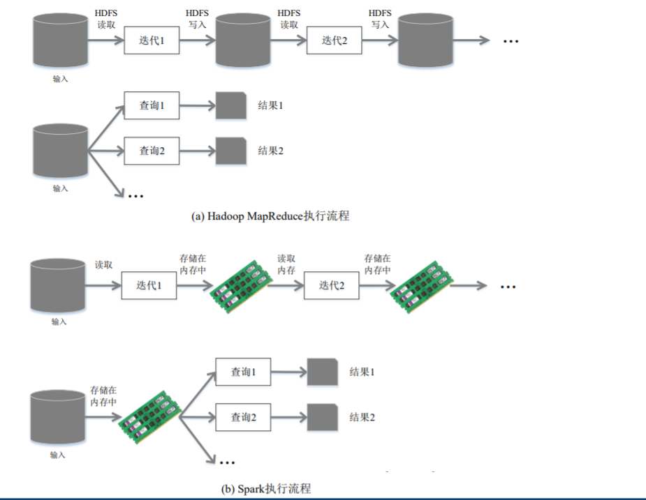 

- 技术栈
  > 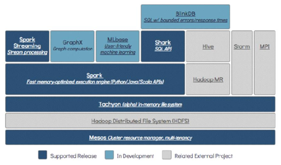 
  - 左上角为spark组件。要学的spark组件为：
    - spark core -- mapreduce
    - Spark sql -- hive
      > 而且spark sql 也可以读取hive中的数据
    - spark steaming -- storm
    - MLlib
    - Graph X
  - HDFS:基于磁盘的文件存储系统。spark可以搭建在hdfs上，也能是本地磁盘
  - Tachyon in-memory file system 。和hdfs功能相同，也是一个文件系统。只不过基于内存
  - 最下面：Mesos Clus..... 是指资源管理框架,常用的资源管理框架有
    > 也有local模式，运行在idea等ide中，用于本地测试
    - Standalone(不是单机模式)
      > Standalone是Spark自带的一个资源调度框架，它支持完全分布式。
    - Yarn
      > Hadoop生态圈里面的一个资源调度框架，Spark也是可以基于Yarn来计算的。<br />
      > 要基于Yarn来进行资源调度，必须实现AppalicationMaster接口，Spark实现了这个接口，所以可以基于Yarn。
    - Mesos 资源调度框架。
  - 补充图：
    > 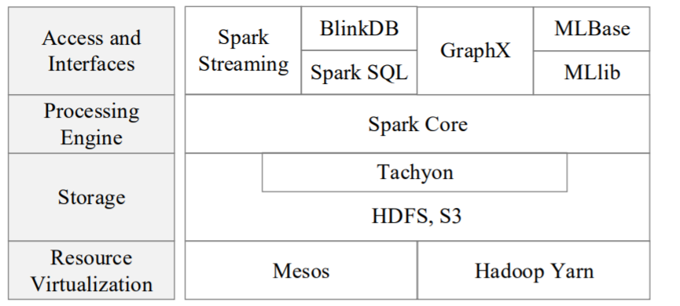 

- spark 设计原则：一个软件栈满足不同应用场景
  >  

- 运行环境
  - kubermete （虚拟镜像，比如docker）
  - standalone(spark 自带的资源框架)
  - clond(云端节点)

- 开发语言
  - scala(好)
  - python(还行，但是很多接口没有，需要自己实现，非常不推荐)
  - java(也有用的)
  - R

## 1.2. 初始基本概念

- RDD：
  - 全称：Resillient Distributed Dataset,弹性分布式数据集
  - 作用：Spark进行数据操作的基本单位
  - 特点：
    - 高度受限的内存共享模型
    - 只读属性

- DAG:
  - 全称：有向无环图
  - 作用： 反应RDD间的依赖关系
    >  

- Executor:
  - 本质：一个进程
  - 作用：
    - 运行在工作节点上的进程
    - 会派生出很多线程，每个线程用来执行一个**任务**

- Application
  - 比如一个wordCount代码，就是一个应用
  - 相关层级：
    - 一个应用程序提交后，会生成多个**作业(Job)**
      > job可以看作和action算子对应
    - 每个作业都会被切割成多个任务集，称为**阶段(Stage)**
    - 每个阶段中包含多个**任务(task)**
      > stage中的task并行执行
    - 图解：
      >  


## 1.3. 基础运行架构

### 1.3.1. 运行架构

- 架构
  > 
  - SparkContext
    - 是整个应用程序的指挥官
    - 代表了应用程序连接集群的通道
  - Cluster Manager
    - 种类：
      - spark自带的(一般不用)
      - hadoop的yarn
      - mesos
    - 资源：
      - cpu
      - 内存
      - 带宽
  - Worker Node
    >  
    - 作用:
      - 驻留Executor 进程
      - Executor会派生出很多线程，每个线程用来执行一个**任务**

- 运行流程：
  - 步骤1
    - 往集群中提交应用程序
    - 确定driver节点
    - Driver节点上创建SparkContext对象
    - SparkContext向资源管理器申请运行Executor的资源
    - 资源管理器分配资源,在worknode上开启Executor
    - Executor运行情况将随着“心跳”发送到资源管理器上
  - 步骤2
    - SparkContext根据代码中的RDD依赖关系生成DAG
    - DAG被提交到DAG Scheduler中解析
    - DAG Scheduler将DAG切成不同的Stage(阶段)
    - 再把stage提交给Task Scheduler
  - 步骤3
    - Worker Node**主动** 向Task Scheduler申请任务运行
    - Task Scheduler把任务分配下去
      - **计算向数据靠拢**原则。Task Scheduler会把任务发送给存有相关数据的机器
  - 步骤4
    - Executor 派生线程，线程执行具体任务
    - 运行得到结果返回给Task Scheduler
    - Task Scheduler将结果返回给DAG Scheduler
    - DAG Scheduler 将结果返回给 SparkContext
    - SparkContext返回数据给用户或者写入到HBase中等
    - 运行完毕后写入数据并释放所有资源。
  - 图解：
    >  


### 1.3.2. DAG优化原理Lineage

- RDD转换构成DAG有向无环图
  >  

- spark 容错机制
  - RDD都是根据RAG中的路径转换过来的
  - 转换前的RDD可以称为转换后RDD的父
    > **血缘关系**
  - 任何一个RDD丢失后都可以通过从父RDD重新转换重新得到

- job划分stage
  - 相关概念
    - 宽依赖（Wide Dependency）
      - 宽依赖则表现为存在一个父RDD的一个分区对应一个子RDD的多个分区
      - 而且只要发生了shuffle，就一定是宽依赖。
        > **只要发生shuffle，就一定要写磁盘。因此无法进行流水线优化**
    - 窄依赖（Narrow Dependency）
      - 一个父RDD的分区对应于一个子RDD的分区
      - 或多个父RDD的分区对应于一个子RDD的分区
    - 图解
      >  
  - 根据DAG图的依赖关系划分
    - 窄依赖不划分阶段
    - 宽依赖划分阶段

- 优化原理
  - spark的fork/join机制:
    >  
    - 是一种并行执行的框架
    - 先将分区 fork(分支)到不同机器上
      - 也就是一个分区分成多个分支
      - 交给不同机器进行处理
    - 然后再将执行结果join起来
  - 一般情况：
    - 多个fork/join连接起来
    - 第一个fork/join的所有分支都完成，才能执行下一个fork/join
    - 也就是说只要有一个分支没完成，join就不能完成
  - 优化情况：
    - 示例
      > 以带着一班人坐飞机从背景，途径上海到厦门
      - 优化前：
        >  
      - 优化后
        >  
  - 划分原因：

- 划分示例：
  >  
  - DAG图通过递归算法生成阶段划分
  - 有兴趣可以查一下

## 1.4. RDD特性详解

- RDD的五大特性：
  > **RDD实际上不存储数据，这里方便理解，暂时理解为存储数据。**
  - 特性
    - 1.RDD是由一系列的partition组成的。
      > 默认RDD和文件的Block一对一。<br />
      > 每个partition都是一个task
    - 2.算子（函数）是**作用在每一个partition（split）**上的。
      > 不是RDD上<br />
      > 但实际其实是类似管道的处理模式，并不是一个一个得处理
    - 3.RDD之间有一系列的依赖关系。
      > 当RDD2丢失后，使用两个RDD间的算子，可以从RDD1重新生成RDD2<br />
      > 这也是弹性的体现
    - 4.分区器是作用在K,V格式的RDD上。
      > 先记住，之后shuffle会提到分区器
    - 5.RDD提供一系列最佳的计算位置。利于数据处理本地化
      > 计算向数据移动
  - 图解
    > 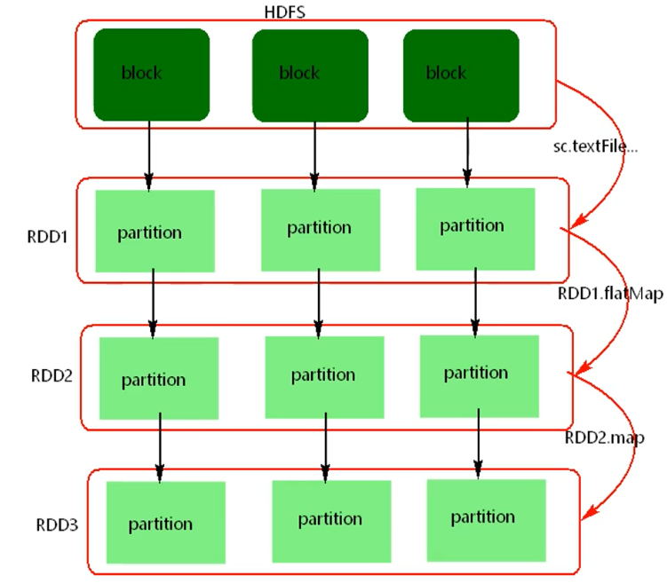 

- 其他点
  - 重要：**RDD实际上不存储数据，这里方便理解，暂时理解为存储数据。**
  - 特性1：
    - textFile方法底层封装的是读取MR读取文件的方式，读取文件之前先split，默认split大小是一个block大小。
    - 也可以自己设定一个block对应多少个partition
  - 特性4：
    - 什么是K,V格式的RDD?
      - 如果RDD里面存储的数据都是二元组对象，那么这个RDD我们就叫做K,V格式的RDD。
  - 特性1和特性3
    - 哪里体现RDD的弹性（容错）？
      - partition数量，大小没有限制，体现了RDD的弹性。
      - RDD之间依赖关系，可以基于上一个RDD重新计算出RDD。(容错)
  - 特性1和特性5：
    - 哪里体现RDD的分布式？
      - RDD是由Partition组成，partition是分布在不同节点上的。
      - RDD提供计算最佳位置，体现了数据本地化。体现了大数据中“计算移动数据不移动”的理念。


## 1.5. Spark 任务执行基本原理

> 具体执行原理见部署一节的不同提交模式的运行原理

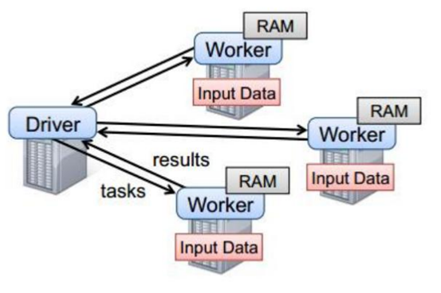

- 以上图中有四个机器节点，Driver和Worker是启动在节点上，运行在JVM中的进程。
  - Driver与集群节点之间有频繁的通信。
  - Driver负责任务(tasks)的分发和结果的回收。任务的调度。如果task的计算结果非常大就不要回收了。会造成oom。
  - Worker是Standalone资源调度框架里面资源管理的从节点。也是JVM进程。
  - Master是Standalone资源调度框架里面资源管理的主节点。也是JVM进程。


## 1.6. Spark代码基本流程

- 流程
  - 创建SparkConf对象
  - 可以设置Application name。
  - 可以设置运行模式及资源需求。
  - 创建SparkContext对象
  - 基于Spark的上下文创建一个RDD，对RDD进行处理。
  - 应用程序中要有Action类算子来触发Transformation类算子执行。
  - 关闭Spark上下文对象SparkContext。

- scala示例
  ```scala
  package com.bjsxt.scala.spark

  import org.apache.spark.rdd.RDD
  import org.apache.spark.{SparkConf, SparkContext}

  /**
    * spark wordcount
    */
  object SparkWC {
    def main(args: Array[String]): Unit = {

      val conf = new SparkConf().setAppName("wordcount").setMaster("local")
      val sc = new SparkContext(conf)
      sc.setLogLevel("Error")
      sc.textFile("./data/words").flatMap( _.split(" ")).map((_,1)).reduceByKey(_+_).foreach(println)// 第二个参数指定分区数
      // 也可以通过sc.parallelize将集合转换为RDD，第二个参数指定分区数
      // 也可以通过sc.makeRDD()将集合转换为RDD,第二个参数指定分区数
      sc.stop()

      // 下面的是演示代码。没有使用链式编程。上面的用了

  //    //conf 可以设置SparkApplication 的名称，设置Spark 运行的模式
  //    val conf = new SparkConf()
  //    conf.setAppName("wordcount")
  //    conf.setMaster("local") // 设置运行方式
  //    conf.set("spark.driver.memory","2") // 设置k-v 。官网 文档 more-configuration
  //    //SparkContext 是通往spark 集群的唯一通道
  //    val sc = new SparkContext(conf)
  //
  //    val lines: RDD[String] = sc.textFile("./data/words") // 每行一个RDD
  //    val words: RDD[String] = lines.flatMap(line => {
  //      line.split(" ")
  //    })  // 切开后，再flat。每一个word对应一个RDD
  //    val pairWords: RDD[(String, Int)] = words.map(word=>{new Tuple2(word,1)}) // 将每个word计数为1，key为work，value为1
  //    val result: RDD[(String, Int)] = pairWords.reduceByKey((v1:Int, v2:Int)=>{v1+v2}) // 对每一个key进行计数
  //    result.foreach(one=>{
  //      println(one)
  //    })
  //    sc.stop()  // 因为是批处理，执行完后都会停。但有个stop的习惯不错

    }
  }
  ```
- scala获取sparkContext另一种方式
  ```scala
  val spark:SparkSession = SparkSession.builder().appName("local").master("local").getOrCreat()
  val sc:SparkContext = spark.sparkContext
  ```

- java示例
  ```java
  package com.bjsxt.java.spark;

  import org.apache.spark.SparkConf;
  import org.apache.spark.api.java.JavaPairRDD;
  import org.apache.spark.api.java.JavaRDD;
  import org.apache.spark.api.java.JavaSparkContext;
  import org.apache.spark.api.java.function.FlatMapFunction;
  import org.apache.spark.api.java.function.Function2;
  import org.apache.spark.api.java.function.PairFunction;
  import org.apache.spark.api.java.function.VoidFunction;
  import scala.Tuple2;

  import java.util.Arrays;
  import java.util.Iterator;

  public class SparkWordCount {
      public static void main(String[] args) {
          SparkConf conf = new SparkConf();
          conf.setMaster("local");
          conf.setAppName("wc");
          JavaSparkContext sc = new JavaSparkContext(conf);
          JavaRDD<String> lines = sc.textFile("./data/words");
          JavaRDD<String> words = lines.flatMap(new FlatMapFunction<String, String>() {
              @Override
              public Iterator<String> call(String line) throws Exception {
                  return Arrays.asList(line.split(" ")).iterator();
              }
          });
          JavaPairRDD<String, Integer> pairWords = words.mapToPair(new PairFunction<String, String, Integer>() {
              @Override
              public Tuple2<String, Integer> call(String s) throws Exception {
                  return new Tuple2<>(s, 1);
              }
          });
          JavaPairRDD<String, Integer> result = pairWords.reduceByKey(new Function2<Integer, Integer, Integer>() {
              @Override
              public Integer call(Integer v1, Integer v2) throws Exception {
                  return v1 + v2;
              }
          });
          result.foreach(new VoidFunction<Tuple2<String, Integer>>() {
              @Override
              public void call(Tuple2<String, Integer> tp) throws Exception {
                  System.out.println();
              }
          });
          sc.stop();
      }
  }
  ```


## 1.7. 算子

### 1.7.1. RDD使用说明

- RDD使用基本原理
  - 把一系列应用逻辑变现为RDD的转换
  - 把转换以DAG图的形式表示
  - 在通过DAG图实现可能的优化
    > 比如流水线化，避免数据写入磁盘

- RDD基本概念
  - 本质：一个**只读**的分区记录集合
    - 数据集文件单台机器放不下
    - 将一个RDD分成很多**分区**
    - 每个分区放在不同的机器上
    - 将数据分布在不同机器的内存中，从而实现分布式并行高效处理

- RDD操作
  - 说明：
    - RDD是只读的，不可以修改
    - 但可以通过转换的过程生成新的RDD
    - 达到修改的效果
  - 转换类型操作(Transformation)
    - 说明：
      - 只记录转换的轨迹
      - 并不会真正发生操作
    - 构成：
      - map
      - filter
      - groupBy
      - join
      - ....
    - 注意：
      - 提供的都是粗粒度的
      - 不适合细粒度的操作，比如指定用户id修改数据等
  - 动作类型操作(Action)
    > 类似java流的终结方法
    - 开始从头到尾的计算

- RDD 惰性调用机制
  >  
  - 只有在执行动作类操作的时候才会触发所有计算


### 1.7.2. transformation 算子

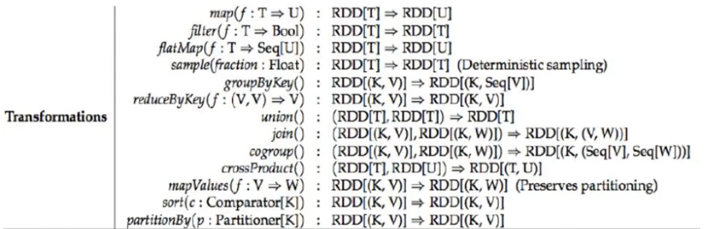

- 概念：
  ```
  Transformations类算子是一类算子（函数）叫做转换算子，如map,flatMap,reduceByKey等。Transformations算子是延迟执行，也叫懒加载执行。
  Transformation类算子：
  ```
- 示例：
  - filter
    > 过滤符合条件的记录数，true保留，false过滤掉。
  - map
    > 将一个RDD中的每个数据项，通过map中的函数映射变为一个新的元素。
    - 特点：输入一条，输出一条数据。
  - flatMap
    >先map后flat。与map类似，每个输入项可以映射为0到多个输出项。
  - sample
    > 随机抽样算子，根据传进去的小数按比例进行又放回或者无放回的抽样。
  - reduceByKey
    > 将相同的Key根据相应的逻辑进行处理。
  - sortByKey/sortBy
    > 作用在K,V格式的RDD上，对key进行升序或者降序排序。
  - sample()
    > 抽样。true的话是有放回抽样。fraction抽样比例。seed种子
  - groupByKey()


### 1.7.3. action算子

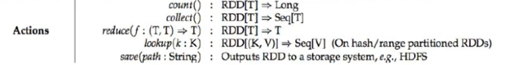

- 概念：
  ```
  Action类算子也是一类算子（函数）叫做行动算子，如foreach,collect，count等。
  Transformations类算子是延迟执行，Action类算子是触发执行。
  ```
  - **一个application应用程序中有几个Action类算子执行，就有几个job运行。**

- Action类算子
  - count
    > 返回数据集中的元素数。**会在结果计算完成后回收到Driver端。**
  - take(n)
    > 返回一个包含数据集前n个元素的集合。
  - first
    > first=take(1),返回数据集中的第一个元素。
  - foreach
    > 循环遍历数据集中的每个元素，运行相应的逻辑。
  - collect
    > 将计算结果回收到Driver端。**放到JVM内存中。如果结果特别大，就不要调了。可能OOM**
  - reduce


### 1.7.4. 持久化算子/控制算子

- 背景
  > 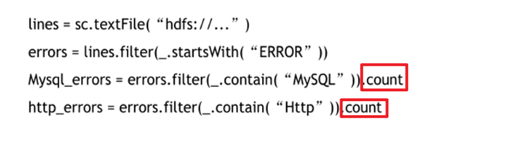 
  - 两个count都会触发一个job。
  - 然后每个都从第一个transformation算子开始执行，读取文件
  - 会有频繁的磁盘io
  - 为了避免这种情况的发生，才会出现控制算子。
  - 是将数据放到内存

- 说明
  - 控制算子有三种，cache,persist,checkpoint，
  - 以上算子都可以将**RDD持久化**，持久化的**单位是partition**。
  - cache和persist,checkpoint都是懒执行的。 必须有一个action类算子触发执行。
  - checkpoint算子不仅能将RDD持久化到磁盘，还能切断RDD之间的依赖关系。

- cache和persist
  - cache
    - 目的：将中间RDD存入内存，避免重新计算
      ```scala
      // 示例代码
      rdd = rdd.cache() // 放入内存。注意，懒执行，在第一次count时才会放入内存
      // 注意，写成rdd.cache()。不加"rdd = " 也行
      // 会自动从内存中找

      rdd.count() 

      rdd.count() // 第二次count，从内存中拿数据，而不用重新计算
      ```
    - 等价于`persist(StorageLevel.Memory_Only)`
  - persist。
    > **可以手动指定持久化级别**。cache就是persist的默认(不传参)级别(可以查看源码)
    - 级别列表(查源码也行)：
      > 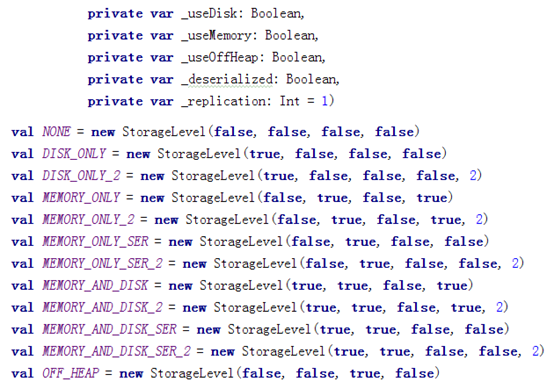 
      - 参数：
        - 是否使用磁盘(使用磁盘的话，下面 不序列化 参数跟着也为false)
        - 是否使用堆内内存
        - 是否使用堆外内存
        - 不序列化？
        - RDD的副本数（默认1）
      - 注意：
        - MEMORY_AND_DISK:是指先往内存放，内存不够了再往磁盘放。（虽说 不序列 参数设置为true，但是往磁盘放的话还是会序列化的）
          > 牺牲性能，换取空间
    - 尽量少用DISK_ONLY级别
  - 注意事项：
    1. cache和persist都是懒执行，必须有一个action类算子触发执行。
    2. cache和persist算子的返回值可以赋值给一个变量，在其他job中直接使用这个变量就是使用持久化的数据了。持久化的单位是partition。
    3. cache和persist算子后不能立即紧跟action算子。那样就直接开始执行job，返回结果了
    4. cache和persist算子持久化的数据**当applilcation执行完成之后会被清除**。
  - 清除方法：unpersist：将持久化到内存的rdd删除(包括cache和persist)

- checkpoint(慎用)
  - 使用时机：逻辑十分复杂的计算完成后，做一个checkpoint
  - 说明
    - checkpoint算子不仅能将RDD持久化到磁盘
    - checkpoint目录数据当application执行完之后不会被清除。也就是切断RDD之间的依赖关系，直接读取checkpoint的数据，不用从头计算
    - 就相当于对中间结果RDD做了个备份，存到磁盘，不需要从头按照lineage开算
  - 流程
    - action开始执行，直接一路下去得到结果。job完成
    - 从最终的RDD开始回溯，回溯到开始，在回溯的时候检查每一个RDD有checkpoint，进行标记
    - 回到开始后，会重新开启一个job，再从头到尾把标记的RDD计算出来，存入磁盘
      - 默认会**从头重新**计算有标记的RDD的结果数据，再存入磁盘中的checkpoint目录
      - 因此有 **优化策略**：在checkpoint那里同时做一个cache，那样会直接把内存中的数据写入磁盘，不会重新计算
        > 最好用
    - 看看就行的图
      > 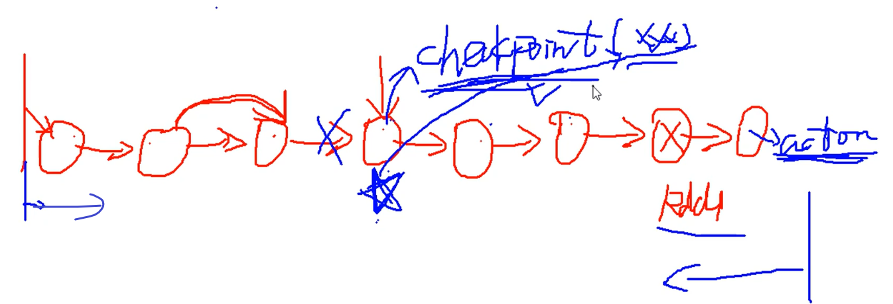 
  - 代码示例：
    ```scala
    object SparkWC {
      def main(args: Array[String]): Unit = {
        val conf = new SparkConf().setAppName("wordcount").setMaster("local")
        val sc = new SparkContext(conf)
        sc.setCheckpintDir("./data/ck") // 设置checkpoint目录

        val rdd = sc.textFile("./data/words").flatMap( _.split(" "))
        rdd.cache()
        rdd.checkpoint() // 进行checkpoint
        rdd.count() // action算子
        sc.stop()
    ```


## 1.8. 部署

### 1.8.1. standalone

#### 1.8.1.1. 部署流程

- 注意一点：
  - spark集群会去/user/bin目录下找java的软链接。
  - 如果是通过rpm安装的jdk，升级jdk时
  - 除了要更改环境变量
  - 也要修改/user/bin下的软链接

- 修改slave，添加worker从节点
- 修改spark-env
  - SPARK_MASTER_HOST=node0011
  - SPARK_MASTER_POST=7077
  - SPARK_WORKER_CORES=2
  - SPARK_WORKER_MEMORY=3g
    > 这个只是逻辑最高定为3g，如果实际内存只给了2g也不会报错
- 进入8080端口，查看webUI界面

#### 1.8.1.2. 运行原理(重要)

##### 1.8.1.2.1. Client模式

- C-S架构
  > 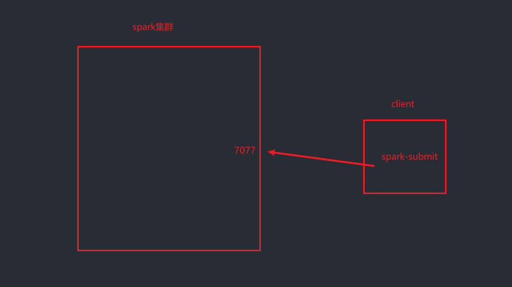-
  ```
  比如使用node0001,node0002,node0003搭建了一个spark集群。
  提交端口为spark://node0011:7077

  在node0004上使用spark-submit命令提交应用
  那么node0004就是客户端(没有跑work，master)
  ```

- 提交任务命令
  > 也就是默认 client
  ```
  ./spark-sumbit --master spark://node0011:7077 --class ...
  ./spark-sumbit --master spark://node0011:7077 --deploy-mode client --class ...
  ```


- Driver与集群的通信包括：
  > Driver可以理解成SparkContext
  1. Driver负责应用程序资源的申请
  2. 任务的分发。
  3. 结果的回收。
  4. 监控task执行情况。

- 流程
  > 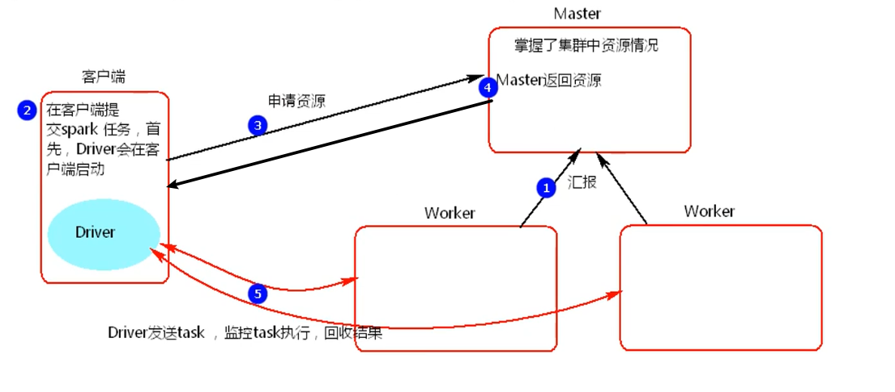 
  - 在Spark客户端submit提交任务，Driver会在客户端启动
  - worker向master汇报资源情况,master记录集群的资源情况
  - Driver向master申请资源
  - master找到满足要求的worker，
  - master反馈给Driver
  - Driver向Worker发送命令,开启Executor
  - Driver向Worker发送task，监控task执行，然后回收结果


- 缺点
  - spark基于standalone-client模式提交任务的话，每个spark application都会有自己的Driver。会有多个Driver进程
  - 因为Driver要发送Task，监控Task，回收结果。会有网络通信
  - 当driver过多时，容易造成网卡流量激增的问题。

- 适用：
  - 适用于应用程序测试，
  - 可以看到执行流程和结果

##### 1.8.1.2.2. cluster模式

- 同样是CS架构，
  - 只不过Driver位置是动态的，
  - 将Driver分散到Worker中

- 提交命令：
  ```
  ./spark-submit 
  --master spark://node0001:7077 
  --deploy-mode cluster
  --class org.apache.spark.examples.SparkPi 
  ../lib/spark-examples-1.6.0-hadoop2.6.0.jar 
  ```
- 过程
  > 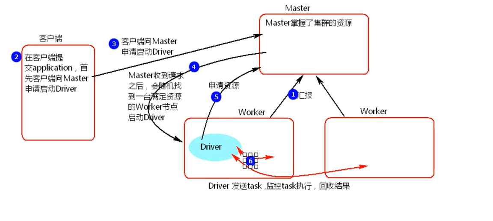 
  - 在客户端通过submit启动任务
  - 客户端向master申请启动Driver
  - master收到请求后，会**随机**找一台满足资源要求的Worker节点启动Driver(接下来的流程和client就相同了)
  - worker向master汇报资源情况,master记录集群的资源情况
  - Driver(位于worker上)向master申请资源
  - master找到满足要求的worker
  - master反馈给Driver(位于worker上)
  - Driver向Worker发送命令,开启Executor
  - Driver(位于worker上)向Worker发送task，监控task执行，然后回收结果

- 适用：
  - 适用于生产环境
  - 必须去webUI(spark的webUI,8080)中查看日志输出和结果
    > 变化：1.6版本中，stdout只有最终结果。而日志放在了stderr。
    > 2.x后，日志也放到了stdout

### 1.8.2. yarn

#### 1.8.2.1. 部署流程

> 其他与standalone流程相同

- 基于yarn 提交任务有可能报错虚拟内存不足
	> 在每台节点中的yarn-site.xml中配值关闭虚拟内存检查
  ```xml
  vim /root/hadoop-2.5.2/etc/hadoop/yarn-site.xml
	<property>  
		<name>yarn.nodemanager.vmem-check-enabled</name>  
		<value>false</value>  
	</property>
  ```

#### 1.8.2.2. 运行原理(重要)

##### 1.8.2.2.1. Client

- 提交命令
  ```
  ./spark-submit 
  --master yarn
  --class org.apache.spark.examples.SparkPi ../lib/spark-examples-1.6.0-hadoop2.6.0.jar
  100

  ./spark-submit 
  --master yarn–client
  --class org.apache.spark.examples.SparkPi ../lib/spark-examples-1.6.0-hadoop2.6.0.jar
  100

  ./spark-submit 
  --master yarn 
  --deploy-mode  client 
  --class org.apache.spark.examples.SparkPi ../lib/spark-examples-1.6.0-hadoop2.6.0.jar
  100
  ```

- 流程
  > 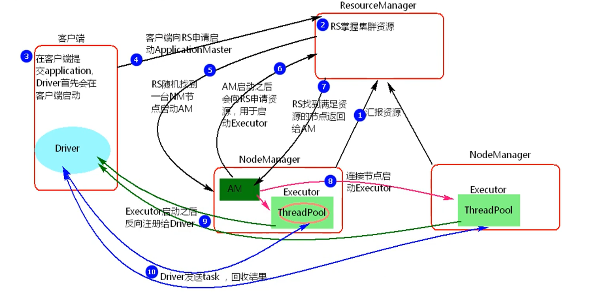 
  - 客户端提交一个Application，在客户端启动一个Driver进程。
  - 应用程序启动后会向RS(ResourceManager)发送请求，请求启动AM(ApplicationMaster)的资源。
  - RS收到请求， **随机** 选择一台NM(NodeManager)启动AM。这里的NM相当于Standalone中的Worker节点。
  - AM启动后，会向RS请求一批container资源，用于启动Executor.
  - RS会找到一批NM返回给AM,用于启动Executor。
  - AM会向NM发送命令启动Executor。
    - task跑在线程池中
  - Executor启动后，会反向注册给Driver，Driver发送task到Executor,执行情况和结果返回给Driver端。
    - 反向注册：Executor向Driver申请task

- 适用：
  - Yarn-client模式同样是适用于测试，
  - 因为Driver运行在本地，Driver会与yarn集群中的Executor进行大量的通信，会造成客户机网卡流量的大量增加.

##### 1.8.2.2.2. Cluster

- 与client相比，仅仅是Driver启动位置不同

- 提交命令：
  ```
  ./spark-submit 
  --master yarn 
  --deploy-mode cluster 
  --class org.apache.spark.examples.SparkPi ../lib/spark-examples-1.6.0-hadoop2.6.0.jar
  100

  ./spark-submit 
  --master yarn-cluster
  --class org.apache.spark.examples.SparkPi ../lib/spark-examples-1.6.0-hadoop2.6.0.jar
  100
  ```

- 流程
  > 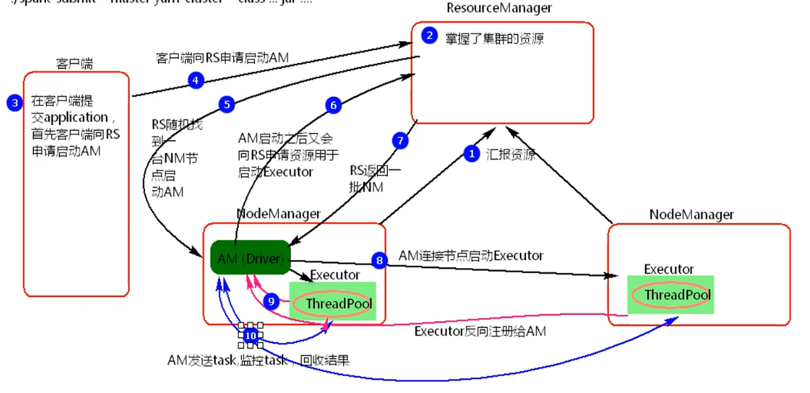 
  - 客户机提交Application应用程序，发送请求到RS(ResourceManager),请求启动AM(ApplicationMaster)。
  - RS收到请求后随机在一台NM(NodeManager)上启动AM（相当于Driver端）。
  - AM启动，AM发送请求到RS，请求一批container用于启动Executor。
  - RS返回一批NM节点给AM。
  - AM连接到NM,发送请求到NM启动Executor。
  - Executor反向注册到AM所在的节点的Driver。Driver发送task到Executor。


- 适用：
  - Yarn-Cluster主要用于生产环境中，
  - 因为Driver运行在Yarn集群中某一台nodeManager中，每次提交任务的Driver所在的机器都是随机的，
  - 不会产生某一台机器网卡流量激增的现象，缺点是任务提交后不能看到日志。只能通过yarn查看日志。
  - 需要去yarn的webui中查看（yarn的webui:8088）

### 1.8.3. sbt 设置

- sbt 配置文件
  ```
  -Dsbt.override.build.repos=true  # 设置配置文件覆盖掉预设的配置
  -Dsbt.coursier.home=D:/learn/sbt/data/coursier # 设置courier目录。idea下载依赖都是下载到这里。不清楚为什么
  -Dsbt.global.base=D:/learn/sbt/data/.sbt # 设置base目录，会存放一些东西
  -Dsbt.ivy.home=D:/learn/sbt/data/.ivy2  # 设置ivy2目录，会存放依赖
  -Dsbt.boot.directory=D:/learn/sbt/data/.sbt/boot # 设置boot目录。不知道存放啥
  -Dsbt.repository.config=D:/learn/sbt/conf/repo.properties # 设置仓库配置文件夹。可以选择阿里云源
  -Dsbt.repository.secure=false  # 不清楚
  -Dsbt.log.format=true  # 
  -Dfile.encoding=UTF8 # 设置编码
  -Xmx512M  # 设置 sbt-launcher 执行的堆最大内存
  -Xss2M
  -XX:+CMSClassUnloadingEnabled
  # 设置代理
  -DsocksProxyHost=127.0.0.1
  -DsocksProxyPort=10808
  ```


## 1.9. 补充算子

- transformation
  - join, leftOuterJoin, rightOuterJoin, fullOuterJoin
    - 说明：作用在K,V格式的RDD上。根据K进行连接，对（K,V）join(K,W)返回（K,(V,W)）
    - 结果类型：使用 leftOuterJoin, rightOuterJoin, fullOuterJoin的话，返回的value元组的右侧，左侧，两侧会为Option类型
      > 因为可能取不到值
    - 分区数量：如果两个分区数量不同的RDD执行join操作，那么结果RDD的分区数是较大的那个
  - union
    - 说明 合并两个数据集。两个数据集的类型要一致。
    - 分区数量：返回的结果RDD的分区数是两个RDD分区数的总和。
  - intersection
    - 说明：取两个数据集的交集
    - 分区数量：返回新的RDD与父RDD分区多的一致
  - subtract
    - 说明：取两个数据集的差集，
    - 分区数量：结果RDD的分区数与subtract前面的RDD的分区数一致。
  - mapPartitions(iter)
    - 说明：
      - 本质就是map，只是操作单位成了分区，而不是行
      - 与map类似，遍历的单位是每个partition上的数据。
      - 如果有两个分区，就会执行两次。
      - iter为**一个分区**中所有数据的迭代器对象
      - 注意：该算子是transformation算子，**最后会返回map后的RDD**
    - 解决问题：
      - 将每一行数据插入到数据库中，比如使用map或者foreach，因为每次只会处理一行数据，需要频繁创建数据库连接
      - 可以通过该方法分别将每个分区的数据拿出来存到listBuffer中，再建立数据库连接。
      - 如果插入数据后不需要使用RDD了，想直接结束，那么可以使用foreachPartitions。
      - 示例
        ```scala
        rdd.mapPartitions(iter=>{
        val list = new ListBuffer[String]
        println("建立数据库连接")
        while(iter.hasNext){
          list.+=(iter.next())
        }
        println("插入数据")
        println("关闭数据库连接")

        list.iterator // 返回map后的数据的迭代器
        })
        ```
  - distinct()
    - 说明：去重
    - 实现原理：
      - map
      - reduceByKey
      - map
  - cogroup 
    - 说明：当调用类型（K,V）和（K，W）的数据上时，返回一个数据集`（K，（Iterable<V>,Iterable<W>））`，
    - 分区数量：子RDD的分区与父RDD多的一致。
    - 示例：
      ```scala
      rdd1 = parallelize(List[(String,Int)])(
        ("key1",1),
        ("key1",1),
        ("key2",1),
      )
      rdd2 = parallelize(List[(String,Int)])(
        ("key1",2),
        ("key1",2),
        ("key2",2),
      )
      rdd3(String,(Iterator[Int],Iterator[Int])) = rdd1.cogroup(rdd2)
      
      // 结果rdd中，String是key
      // 第一个Iterator是rdd1中，key对应的所有值。比如key1的第一个iterator中值为1,1
      // 第二个Iterator是rdd2中，key对应的所有值。比如key1的第二个iterator中值为2,2
      ```
- action
  - foreachPartition
    - 说明：
      - 遍历的数据是每个partition的数据
      - 本质就是foreach
      - 只是操作单位是分区

## 1.10. 术语回顾

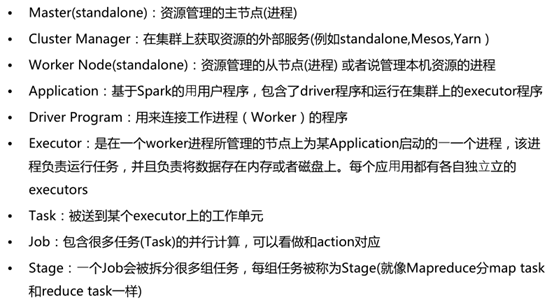

- cluster manager:就是指资源调度框架
- Appalication:
  - Driver程序：就是SparkContext
  - **每一个Appalication有自己独立的Driver**
  - executor: 就是task中的业务逻辑
- Driver Program :就是Driver，用来发送task

## 1.11. spark 执行原理细节

### 1.11.1. RDD宽窄依赖与阶段划分复习


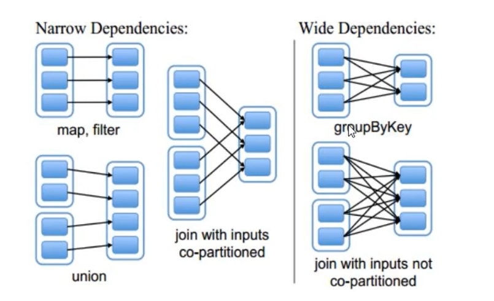

- 宽依赖涉及了节点间的数据传输，有shuffle

### 1.11.2. 计算模式

#### stage划分

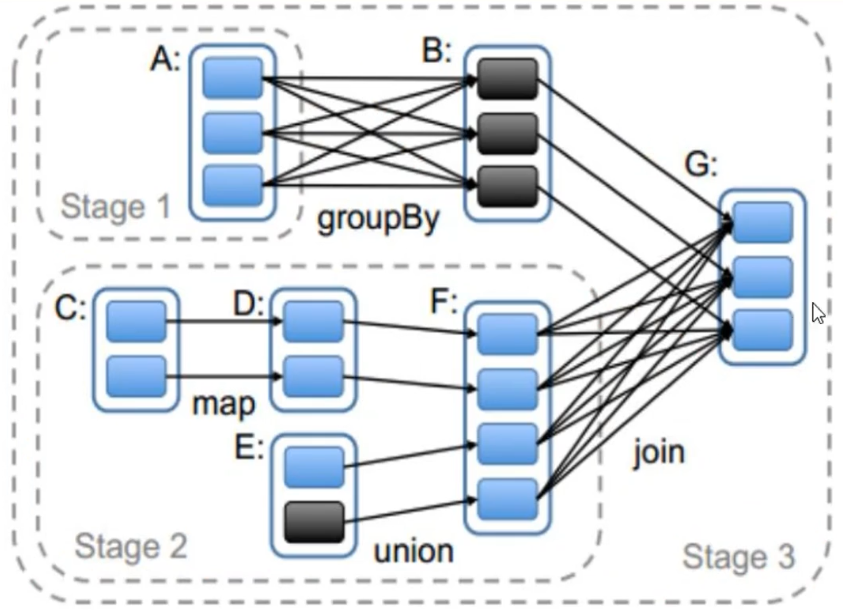

- 遇见宽依赖就划一刀

#### RDD不存储数据

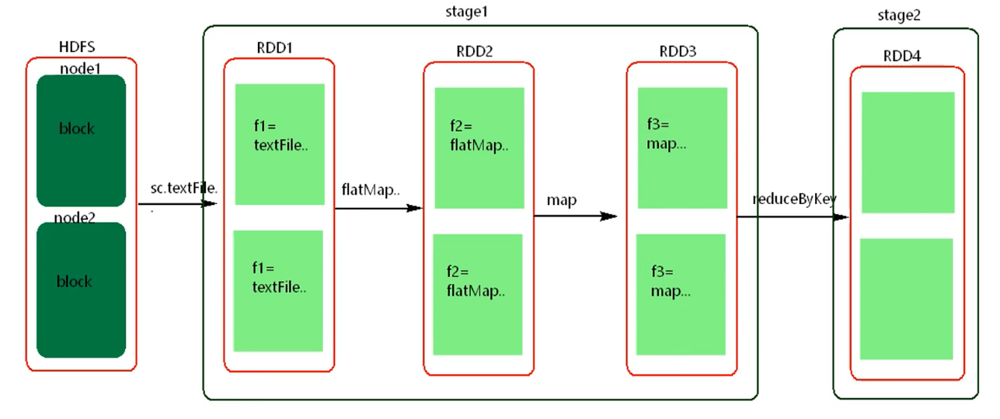

- RDD中放的是具体的处理逻辑

#### 数据处理模式

- 管道处理模式
  - 不是把每一步把全部数据处理完后，放到内存中，再进行下一步的处理
  - 而每一条数据一条链处理下去，不会有中间结果(除非使用持久化算子)，再进行下一步处理
  - 如同：`f3(f2(f1(data)))`
  - 每一条数据的处理可以看作一个管道，中间结果不会写入磁盘
  - 最后落地，才会处理下一条
    - shuffle write 时落地
    - RDD进行持久化时

- stage中的task并行
  > **stage间肯定是顺序执行，一个stage的输出是另一个stage的输入**
  > 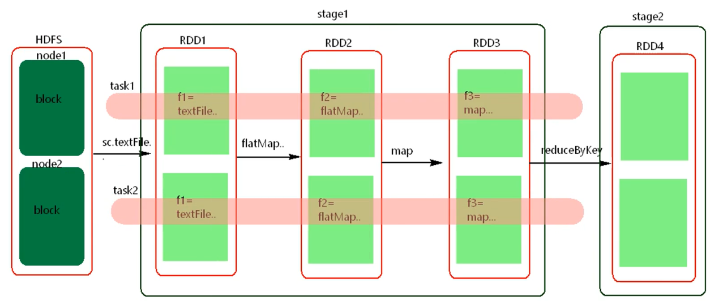 
  - 两个管道并行处理
  - 根据数据来源分发task，**计算向数据移动**

- stage的并行度：
  - 由stage中最后一个RDD的分区数决定
  - 但前面的RDD也会影响并行度
  - 例
    > 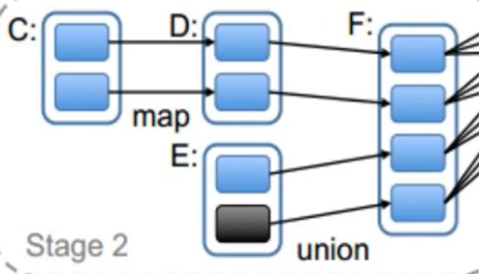 

- 一些问题：
  - stage中的task处理逻辑都是相同的？
    - 不是
    - 例：下面四个task
      >  
  - 如何提高并行度：
    - 增加分区数
    - 使用带有shuffle的算子时，指定分区数
      - 比如：reduceBykey，join，distinct等，基本上bykey的都是带有shuffle的算子


### 1.11.3. 任务切分与task发送

### 1.11.4. 资源调度与任务调度

## 1.12. PV,UV

## 1.13. submit 参数

## 1.14. 源码解析

### 1.14.1. submit源码

### 1.14.2. 资源调度源码

### 1.14.3. 任务调度源码

## 1.15. 共享变量

### 1.15.1. 广播变量

- 问题代码
  ```scala
  val conf = new SparkConf()
  conf.setMaster("local").setAppName("brocast")
  val sc = new SparkContext(conf)
  val list = List("hello xasxt") 
  val lineRDD = sc.textFile("./words.txt")
  lineRDD.filter { x =>!list.contains(x) }.foreach { println}
  sc.stop()
  ```

- 说明
  - 如果不使用广播变量
  - **每次**使用Driver中的变量时
  - 需要Driver往Executor中发送task,task中存有变量。
  - 很多传输变量的task会十分浪费内存

- 图解
  > 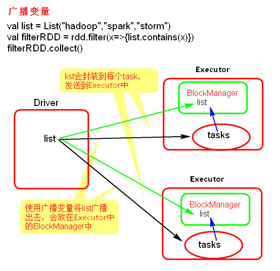

- **注意事项**
  - 不能将一个RDD使用广播变量广播出去，因为RDD是不存储数据的。但可以将RDD的结果广播出去。
  - 广播变量只能在Driver端定义，不能在Executor端定义。
  - 在Driver端可以修改广播变量的值，在Executor端无法修改广播变量的值。

- 示例代码
  ```scala
  val conf = new SparkConf()
  conf.setMaster("local").setAppName("brocast")
  val sc = new SparkContext(conf)
  val list = List("hello xasxt") // 该变量要广播出去
  val broadCast = sc.broadcast(list) // 广播，返回broadCast。里面存着广播变量
  val lineRDD = sc.textFile("./words.txt")
  lineRDD.filter { x => broadCast.value.contains(x) }.foreach { println} // 在RDD调用时使用broadCast。.value提取变量
  sc.stop()
  ```

### 1.15.2. 累加器

- 问题示例
  > 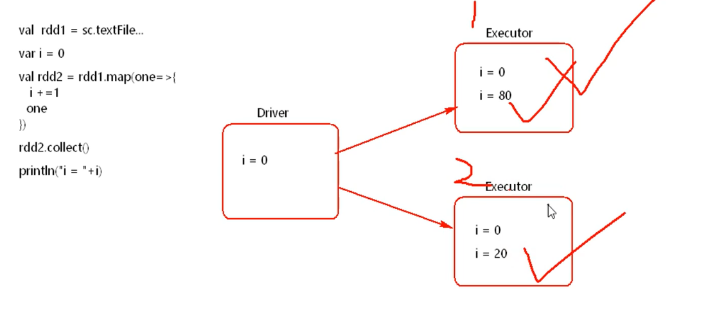 
  - 对i进行累加，最后打印。
  - 会发现，最后打印的是0.
  - 这是因为该任务会分发到各个Executor
  - 每个Executor上会进行累加。
  - 但是driver不会执行计算，也就不会累加。依旧为0


- 原理
  - 每个节点累加后返回结果到driver
  - driver再把所有结果进行相加

- 图解
  > 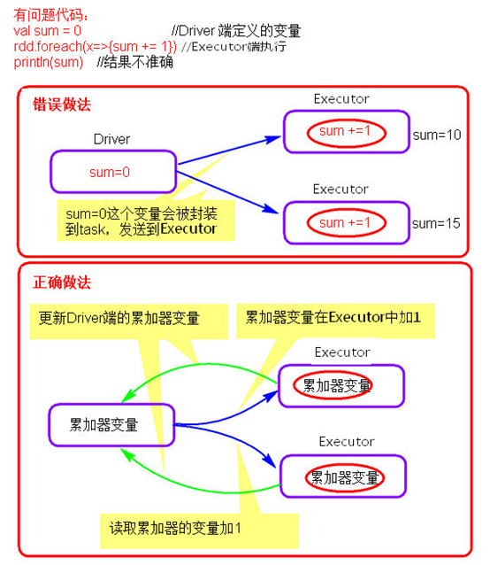 
- 注意：
  -	累加器在Driver端定义赋初始值，累加器只能在Driver端读取，在Excutor端更新。
  -	**版本变化：武器1.6版本中是无法通过`.value`获取值的**
- 示例代码
  ```scala
  val conf = new SparkConf()
  conf.setMaster("local").setAppName("accumulator")
  val sc = new SparkContext(conf)
  val accumulator = sc.longAccumulator
  val rdd1= sc.textFile("./words.txt")
  val rdd2 = rdd1.map(one=>{
    accumulator.add(1)
    println(s"Executor accumulator is ${accumulator.value}")
  })
  rdd2.collect()// 返回结果给driver
  ```


## 1.16. WebUI

## 1.17. 历史日志服务器

## 1.18. Spark Master

### 1.18.1. HA

### 1.18.2. 切换验证

### 1.18.3. pipeline

## 1.19. Spark shuffle


# 2. Spark sql

# 3. Spark Streaming


