# Spark

## 生态系统

## 基本概念

- RDD：
  - 全称：Resillient Distributed Dataset,弹性分布式数据集
  - 作用：Spark进行数据操作的基本单位
  - 特点：
    - 高度受限的内存共享模型
    - 只读属性

- DAG:
  - 全称：有向无环图
  - 作用： 反应RDD间的依赖关系
    > 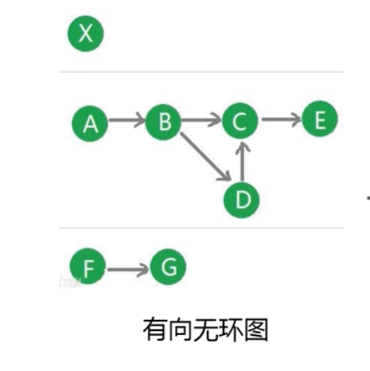 

- Executor:
  - 本质：一个进程
  - 作用：
    - 运行在工作节点上的进程
    - 会派生出很多线程，每个线程用来执行一个**任务**

- Application
  - 比如一个wordCount代码，就是一个应用
  - 相关层级：
    - 一个应用程序提交后，会生成多个**作业(Job)**
    - 每个作业都会被切割成多个任务集，称为**阶段(Stage)**
    - 每个阶段中包含多个任务
    - 图解：
      > 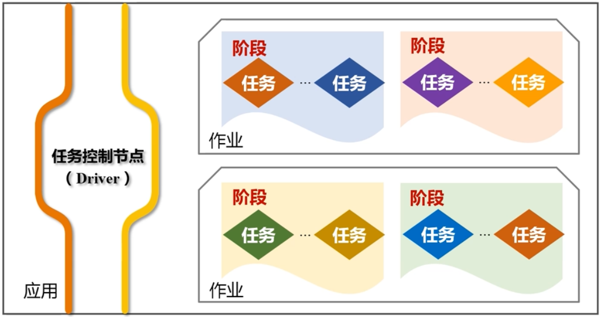 

## RDD详解

- 设计原因：
  - mapreduce 无法很好得完成迭代计算和反复读写工作子集
  - IO开销太大;序列化，反序列化开销太大

- RDD使用基本原理
  - 把一系列应用逻辑变现为RDD的转换
  - 把转换以DAG图的形式表示
  - 在通过DAG图实现可能的优化
    > 比如流水线化，避免数据写入磁盘

- RDD基本概念
  - 本质：一个**只读**的分区记录集合
    - 数据集文件单台机器放不下
    - 将一个RDD分成很多**分区**
    - 每个分区放在不同的机器上
    - 将数据分布在不同机器的内存中，从而实现分布式并行高效处理

- RDD操作
  - 说明：
    - RDD是只读的，不可以修改
    - 但可以通过转换的过程生成新的RDD
    - 达到修改的效果
  - 转换类型操作(Transformation)
    - 说明：
      - 只记录转换的轨迹
      - 并不会真正发生操作
    - 构成：
      - map
      - filter
      - groupBy
      - join
      - ....
    - 注意：
      - 提供的都是粗粒度的
      - 不适合细粒度的操作，比如指定用户id修改数据等
  - 动作类型操作(Action)
    > 类似java流的终结方法
    - 开始从头到尾的计算

- RDD 惰性调用机制
  > 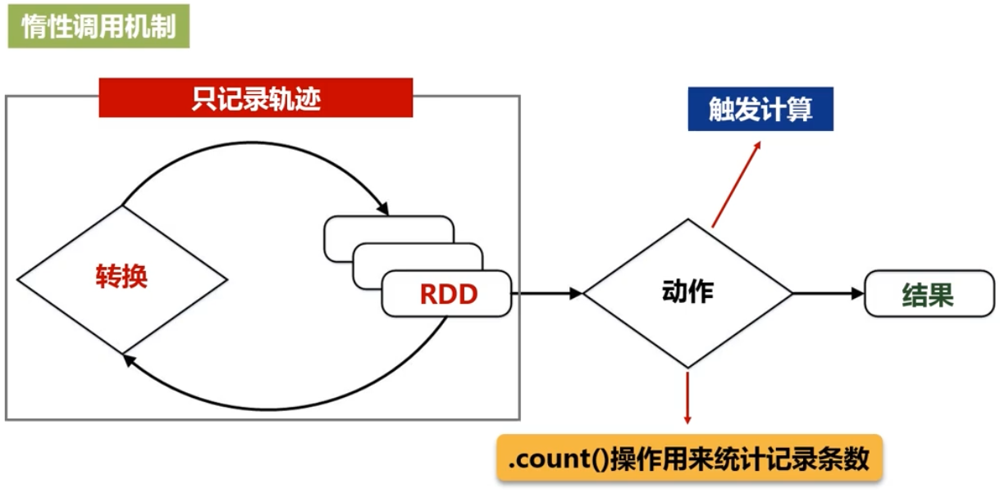 
  - 只有在执行动作类操作的时候才会触发所有计算

- RDD转换构成DAG有向无环图
  > 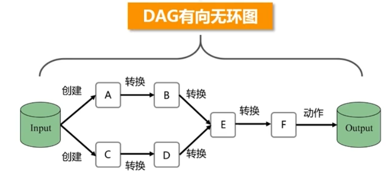 

## DAG优化原理

- spark 容错机制
  - RDD都是根据RAG中的路径转换过来的
  - 转换前的RDD可以称为转换后RDD的父
    > **血缘关系**
  - 任何一个RDD丢失后都可以通过从父RDD重新转换重新得到

- job划分stage
  - 相关概念
    - 宽依赖（Wide Dependency）
      - 宽依赖则表现为存在一个父RDD的一个分区对应一个子RDD的多个分区
      - 而且只要发生了shuffle，就一定是宽依赖。
        > **只要发生shuffle，就一定要写磁盘。因此无法进行流水线优化**
    - 窄依赖（Narrow Dependency）
      - 一个父RDD的分区对应于一个子RDD的分区
      - 或多个父RDD的分区对应于一个子RDD的分区
    - 图解
      > 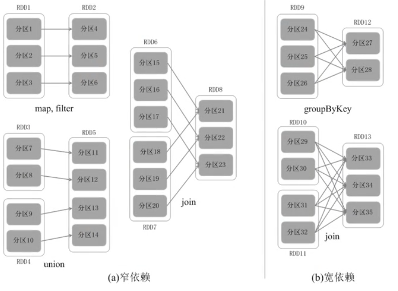 
  - 根据DAG图的依赖关系划分
    - 窄依赖不划分阶段
    - 宽依赖划分阶段

- 优化原理
  - spark的fork/join机制:
    > 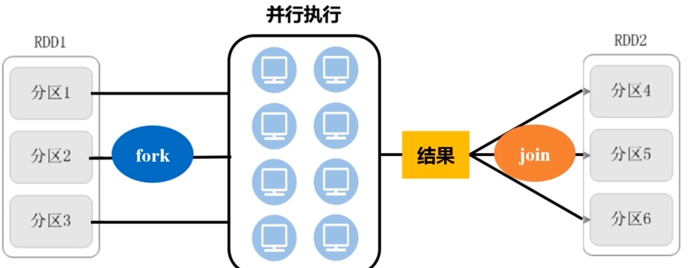 
    - 是一种并行执行的框架
    - 先将分区 fork(分支)到不同机器上
      - 也就是一个分区分成多个分支
      - 交给不同机器进行处理
    - 然后再将执行结果join起来
  - 一般情况：
    - 多个fork/join连接起来
    - 第一个fork/join的所有分支都完成，才能执行下一个fork/join
    - 也就是说只要有一个分支没完成，join就不能完成
  - 优化情况：
    - 示例
      > 以带着一班人坐飞机从背景，途径上海到厦门
      - 优化前：
        > 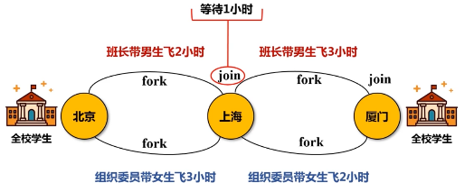 
      - 优化后
        > 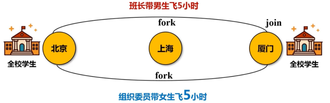 
  - 划分原因：

- 划分示例：
  > 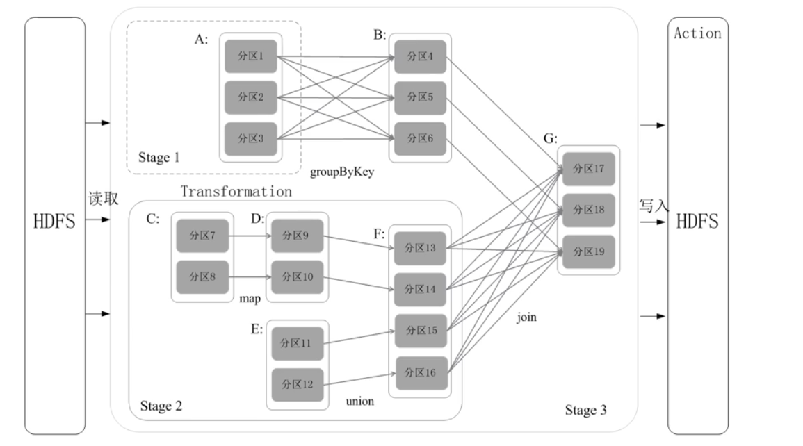 
  - DAG图通过递归算法生成阶段划分
  - 有兴趣可以查一下

## 运行架构

- 架构
  > 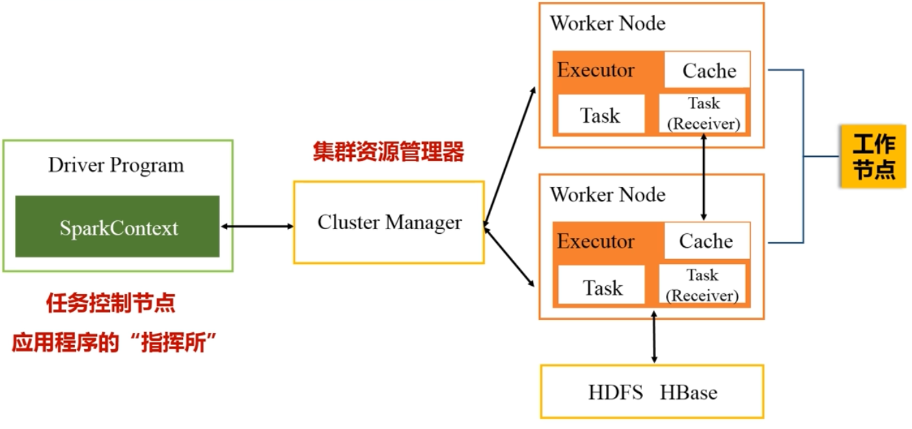
  - SparkContext
    - 是整个应用程序的指挥官
    - 代表了应用程序连接集群的通道
  - Cluster Manager
    - 种类：
      - spark自带的(一般不用)
      - hadoop的yarn
      - mesos
    - 资源：
      - cpu
      - 内存
      - 带宽
  - Worker Node
    > 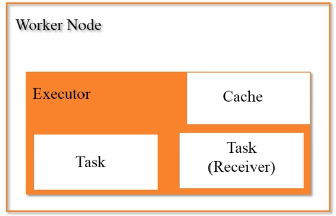 
    - 作用:
      - 驻留Executor 进程
      - Executor会派生出很多线程，每个线程用来执行一个**任务**

- 运行流程：
  - 步骤1
    - 往集群中提交应用程序
    - 确定driver节点
    - Driver节点上创建SparkContext对象
    - SparkContext向资源管理器申请运行Executor的资源
    - 资源管理器分配资源,在worknode上开启Executor
    - Executor运行情况将随着“心跳”发送到资源管理器上
  - 步骤2
    - SparkContext根据代码中的RDD依赖关系生成DAG
    - DAG被提交到DAG Scheduler中解析
    - DAG Scheduler将DAG切成不同的Stage(阶段)
    - 再把stage提交给Task Scheduler
  - 步骤3
    - Worker Node**主动** 向Task Scheduler申请任务运行
    - Task Scheduler把任务分配下去
      - **计算向数据靠拢**原则。Task Scheduler会把任务发送给存有相关数据的机器
  - 步骤4
    - Executor 派生线程，线程执行具体任务
    - 运行得到结果返回给Task Scheduler
    - Task Scheduler将结果返回给DAG Scheduler
    - DAG Scheduler 将结果返回给 SparkContext
    - SparkContext返回数据给用户或者写入到HBase中等
    - 运行完毕后写入数据并释放所有资源。
  - 图解：
    > 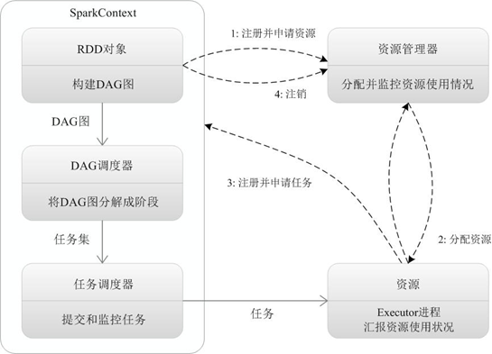 

## 部署
