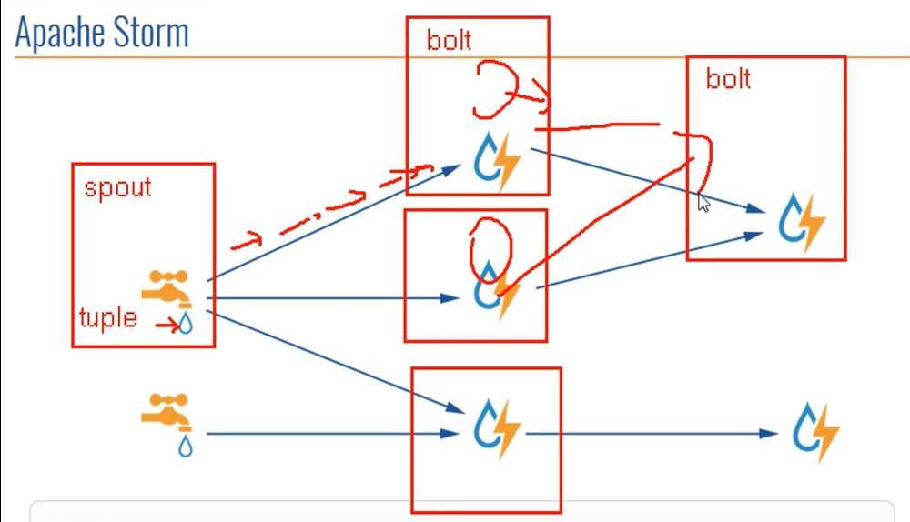
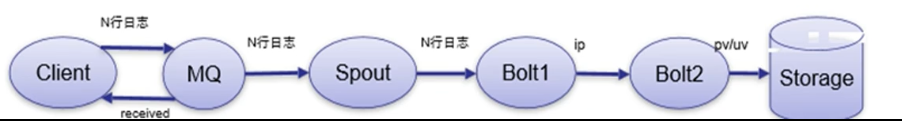
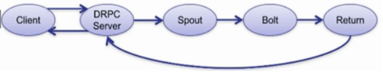
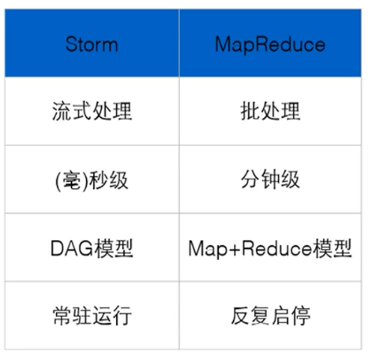
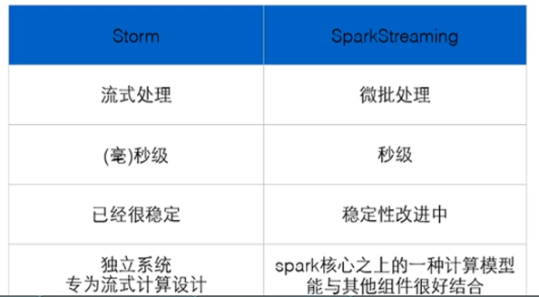
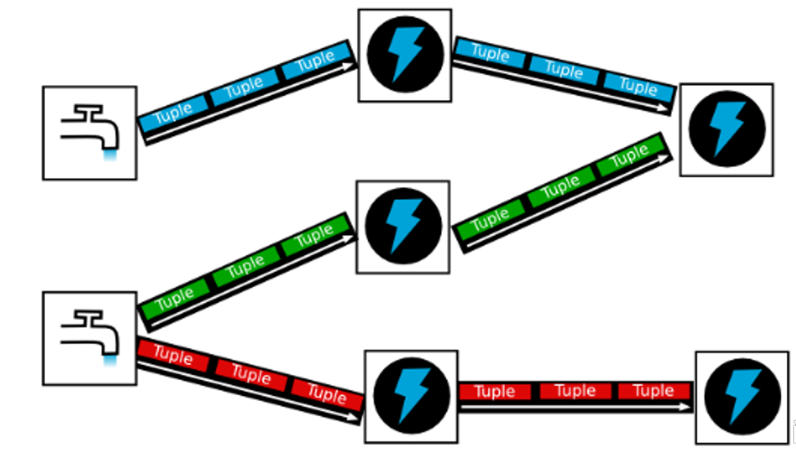

# 1. 概述

```
twitter开源
```

- storm 计算系统
  - 实时性
    - storm 进程常驻内存。
      > hadoop 进程只有在有 job 时才会开启
    - storm 数据不经过磁盘，在内存中处理。
  - 分布式
  - 高容错/高可靠性
    - 异常处理：节点宕机，进程关闭等
    - 消息可靠保障机制（ACK）
  - 可维护性：StormUI 图像化监控接口

---

- 拓扑图：spout+bolt 构成的 directed acyclic graph dag(有向无环图)
  > 
  - spout：数据发起源，可以有多个
  - tuple：单位数据
  - bolt：数据处理单元。
    - 横向扩展：bolt 的处理逻辑非常简单迅速，多种简单处理逻辑串联起来，保障实时性。
    - 纵向扩展：纵向多个 blot，每个 bolt 的处理逻辑可以相同，多线程模式，加快处理速度。

---

- 架构
  - Nimbus:主节点守护进程
    > 类似 jobtracker，但是压力要远低于 jobtracker
    - 资源调度
    - 任务分配
    - jar 包任务上传
  - Supervisor:从节点守护进程（监督进程）
  - Worker:从节点上 Supervisor 开启的工作进程

---

- 编程模式
  - DAG
  - Spout
  - Bolt

---

- 数据传输
  - ZMQ(twitter 早期产品，已不再使用):
    - ZeroMQ 开源的消息传递框架，并不是一个 MessageQueue
  - Netty:
    - Netty 是基于 NIO 的网络框架，更加高效。
    - 之所以 Storm 0.9 版本之后使用 Netty,是因为 ZMQ 的 license 和 Storm 的 license 不兼容。

---

- 用途
  - 流式处理（都是实时的）
    - 异步:客户端提交数据进行结算，并不会等待数据计算结果
      > 
    - 同步:客户端提交数据请求后，立即取得计算结果并返回给客户端
      > 
      - 启用远程同步服务的话，需要DRPC Server(Distributed Remote Procedure Call)
        > RPC远程服务调用复习
  - 逐条处理：如ETL
  - 统计分析：
    ```
    计算PV、UV、访问热点以及某些数据的聚合、加和、平均等
    客户端提交数据之后，计算完成结果存储到Redis、HBase、MySQL或者其他MQ当中，
    客户端并不关心最终结果是多少。
    ``` 

---

- 与mapreduce比较
  > 
  - Storm:进程、线程常驻内存运行，数据不进入磁盘，数据通过网络传递。
  - MapReduce:为TB、PB级别数据设计的批处理计算框架。
- 与Spark Streaming比较
  >  
  - Storm:纯流式处理
    - 专门为流式处理设计
    - 数据传输模式更为简单，很多地方也更为高效
    - 并不是不能做批处理，它也可以来做微批处理，来提高吞吐
  - Spark Streaming:微批处理
    - 将RDD做的很小来用小的批处理来接近流式处理
    - 基于内存和DAG可以把处理任务做的很快

# 2. 计算模型

## 2.1. 理论说明




- Topology - DAG有向无环图的实现
  - 对于Storm实时计算逻辑的封装
  - 即，由一系列通过数据流相互关联的Spout、Bolt所组成的拓扑结构
  - 生命周期：此拓扑只要启动就会一直在集群中运行，直到手动将其kill，否则不会终止（区别于MapReduce当中的Job，MR当中的Job在计算执行完成就会终止）

---

- Tuple - 元组
  - Stream中最小数据组成单元

- Stream - 数据流
  >  
  - 从Spout中源源不断传递数据给Bolt、以及上一个Bolt传递数据给下一个Bolt，所形成的这些数据通道即叫做Stream
  - Stream声明时需给其指定一个Id（默认为Default）
    > 实际开发场景中，多使用单一数据流，此时不需要单独指定StreamId

---

- Spout - 数据源
  - 拓扑中数据流的来源。一般会从指定外部的数据源读取元组（Tuple）发送到拓扑（Topology）中
  - 一个Spout可以发送多个数据流（Stream）
    - 可先通过OutputFieldsDeclarer中的declare方法声明定义的不同数据流，发送数据时通过SpoutOutputCollector中的emit方法指定数据流Id（streamId）参数将数据发送出去
  - Spout中最核心的方法是nextTuple，该方法会被Storm线程不断调用、主动从数据源拉取数据，再通过emit方法将数据生成元组（Tuple）发送给之后的Bolt计算

---

- Bolt - 数据流处理组件
  - 拓扑中数据处理均有Bolt完成。对于简单的任务或者数据流转换，单个Bolt可以简单实现；更加复杂场景往往需要多个Bolt分多个步骤完成
  - 一个Bolt可以发送多个数据流（Stream）
    - 可先通过OutputFieldsDeclarer中的declare方法声明定义的不同数据流，发送数据时通过SpoutOutputCollector中的emit方法指定数据流Id（streamId）参数将数据发送出去
    - 可有可无，对于最后一个Blot就不需要再再推送数据。
  - Bolt中最核心的方法是execute方法，该方法负责接收到一个元组（Tuple）数据、真正实现核心的业务逻辑

## 2.2. wordcount示例

- spout
  <details>
    <summary>代码</summary>

    ```java
    package com.test.spout;

    import org.apache.storm.spout.SpoutOutputCollector;
    import org.apache.storm.task.TopologyContext;
    import org.apache.storm.topology.OutputFieldsDeclarer;
    import org.apache.storm.topology.base.BaseRichSpout;
    import org.apache.storm.tuple.Fields;
    import org.apache.storm.tuple.Values;

    import java.util.List;
    import java.util.Map;

    /**
    * @author liyu
    */
    public class WcSpout extends BaseRichSpout {

        private Map<String, Object> map;
        private TopologyContext topologyContext;
        private SpoutOutputCollector spoutOutputCollector;
        private int i = 0;

        /**
        * map – The Storm configuration for this spout. This is the configuration provided to the topology merged in
        * with cluster configuration on this machine.
        * <p>
        * topologyContext – This object can be used to get information about this task's place within the topology,
        * including the task id and component id of this task, input and output information, etc.
        * <p>
        * spoutOutputCollector – The collector is used to emit tuples from this spout. Tuples can be emitted at any
        * time, including the open and close methods. The collector is thread-safe and should be saved as an instance
        * variable of this spout object.
        */
        @Override
        public void open(Map<String, Object> map, TopologyContext topologyContext,
                        SpoutOutputCollector spoutOutputCollector) {
            // 提升作用域
            this.map = map;
            this.topologyContext = topologyContext;
            this.spoutOutputCollector = spoutOutputCollector;

        }

        /**
        * 1+2+3+4....
        */
        @Override
        public void nextTuple() {
            i++;
            List<Object> tuple = new Values(i);
            this.spoutOutputCollector.emit(tuple);
            System.err.println("spout-------" + i);
            try {
                Thread.sleep(1000);
            } catch (InterruptedException e) {
                e.printStackTrace();
            }
        }

        // 注意：每一个tuple中有多少个值，就要对应多少个filed，否则会报错。
        // 上面只有一个i，下面也只有一个num，没问题

        @Override
        public void declareOutputFields(OutputFieldsDeclarer outputFieldsDeclarer) {
            outputFieldsDeclarer.declare(new Fields("num"));
        }
    }
    ```
  </details>
- bolt
  <details>
    <summary>代码</summary>

    ```java
    package com.test.bolt;

    import org.apache.storm.task.OutputCollector;
    import org.apache.storm.task.TopologyContext;
    import org.apache.storm.topology.OutputFieldsDeclarer;
    import org.apache.storm.topology.base.BaseRichBolt;
    import org.apache.storm.tuple.Fields;
    import org.apache.storm.tuple.Tuple;

    import java.util.Map;

    /**
    * @author liyu
    */
    public class WcBolt extends BaseRichBolt {

        int sum = 0;
        private Map<String, Object> topoConf;
        private TopologyContext context;
        private OutputCollector collector;

        /**
        * topoConf – The Storm configuration for this bolt. This is the configuration provided to the topology merged in
        * with cluster configuration on this machine.
        *
        * context – This object can be used to get information about this task's place within the topology, including
        * the task id and component id of this task, input and output information, etc.
        *
        * collector – The collector is used to emit tuples from this bolt. Tuples can be emitted at any time, including
        * the prepare and cleanup methods. The collector is thread-safe and should be saved as an instance variable of
        * this bolt object.
        */
        @Override
        public void prepare(Map<String, Object> topoConf, TopologyContext context, OutputCollector collector) {
            this.topoConf = topoConf;
            this.context = context;
            this.collector = collector;

        }

        @Override
        public void execute(Tuple input) {
            // 1.获取数据
            Integer num = input.getIntegerByField("num");

            // 2. 求和累加
            sum += num;
            System.out.println("sum------------------" + sum);

        }

        @Override
        public void declareOutputFields(OutputFieldsDeclarer declarer) {

        }
    }
    ```
  </details>
- 主运行类
  <details>
    <summary>代码</summary>

    ```java
    package com.test.run;

    import com.test.bolt.WcBolt;
    import com.test.spout.WcSpout;
    import org.apache.storm.Config;
    import org.apache.storm.LocalCluster;
    import org.apache.storm.thrift.TException;
    import org.apache.storm.topology.TopologyBuilder;

    /**
    * @author liyu
    */
    public class wordcount {
        public static void main(String[] args) throws Exception {
            TopologyBuilder tb = new TopologyBuilder();
            // 设置soput
            tb.setSpout("wordcountspout", new WcSpout());

            // 设置bolt
            // 并且把spout和bolt关联起来,以shuffle的方式分发数据。之后会详细说明奋分发策略。
            tb.setBolt("wordcountbolt", new WcBolt()).shuffleGrouping("wordcountspout");

            // 本地window上运行
            LocalCluster lc = new LocalCluster();
            lc.submitTopology("wc",new Config(),tb.createTopology());

        }
    }
    ```
  </details>

# 3. 分组策略

Stream Grouping - 数据流分组（即数据分发策略）

