# 1. 开始

- 发展：
  - 人工智能：最早出现的概念，指一些自动化的程序
  - 机器学习：对数据进行自动分析获得规律
  - 深度学习：机器学习中较为复杂的算法，比如图像识别等
    > 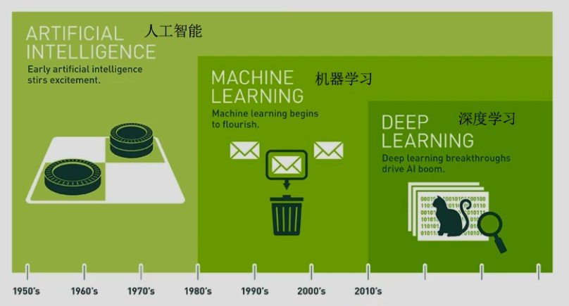
- 影响因素；
  - 硬件计算水平
  - 数据量多少
  - 算法发展
- 应用：

  - 自然语言处理
  - 图像识别
  - 传统预测

- 机器学习库和框架

  - 前面部分使用：scikit learn
  - 后面部分使用：tensorflow(用的最火)
  - 框架列表：
    > 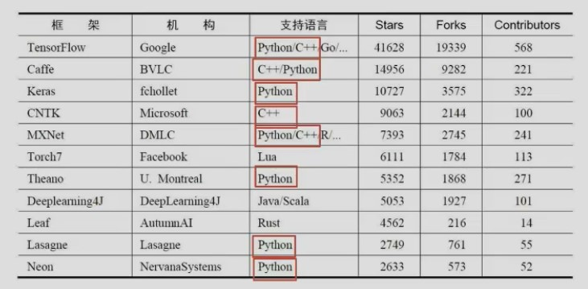

- 书籍推荐

  > 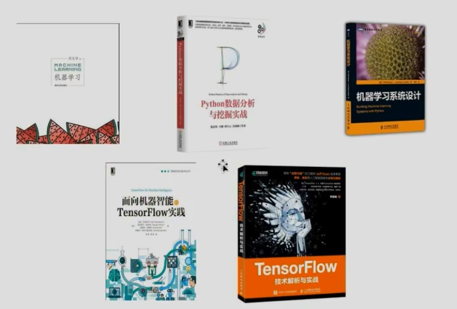

- 数据集：

  > 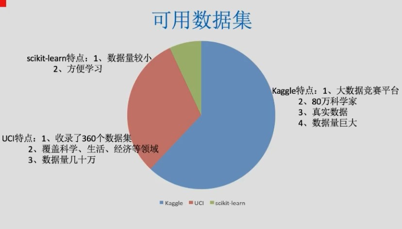

- 数据集结构：

  - 特征值，即 x
  - 目标值，即 y

- 基本流程：
  > 

# 2. scikit-learn

## 2.1. 优缺点

- sklearn
  - 有点：封装好，建立模型简单，预测简单
  - 缺点：算法的过程，部分参数都在内部自行优化
- tensorflow:封装高低的api都有，可以自己实现算法

## 2.2. 数据抽取

### 2.2.1. 字典数据抽取

#### 2.2.1.1. DictVectorizer

将字典转换为矩阵

```py
# 导包
from sklearn.feature_extraction import DictVectorizer

def main():
    # 实例化数据抽取对象
    # 默认sparse为true，会将矩阵转换为sparse
    dictVector = DictVectorizer(sparse=False)

    # 调用fit_transform
    rdata=dictVector.fit_transform(
        [
          {
              "name": 1,
              "value": "value1"
          },
          {
              "name": 2,
              "value": "value2"
          },
          {
              "name": 3,
              "value": "value3"
          }
        ]
    )
    print(dictVector.get_feature_names())
    print((rdata))
    print(type(rdata))
    """
    输出：
    ['name', 'value=value1', 'value=value2', 'value=value3']
    [[1. 1. 0. 0.]
    [2. 0. 1. 0.]
    [3. 0. 0. 1.]]
    <class 'numpy.ndarray'>

    数字为值的第一列为name;字符串为值的value会转换为第二，三，四列，true为1，false为0(one-hot编码)
    默认会通过sparse压缩，所以不必担心内存

    sparse矩阵：
      (0, 0)        1.0
      (0, 1)        1.0
      (1, 0)        2.0
      (1, 2)        1.0
      (2, 0)        3.0
      (2, 3)        1.0
    """

if __name__ == "__main__":
    main()

```

### 2.2.2. 文本特征抽取

#### 2.2.2.1. Count

> 统计单词出现频率

```py
# 导入特征抽取类
from sklearn.feature_extraction.text import CountVectorizer

def main():
    cv = CountVectorizer()
    # 实例化
    rdata = cv.fit_transform(
        ["life is short,I use python", "life is too long,i don't use python"])
        # 传入两篇文章
    print(rdata)
    print(cv.get_feature_names())
    print((rdata.toarray()))
    pass

if __name__ == "__main__":
    main()
"""
结果：
  (0, 2)        1
  (0, 1)        1
  (0, 5)        1
  (0, 7)        1
  (0, 4)        1
  (1, 2)        1
  (1, 1)        1
  (1, 7)        1
  (1, 4)        1
  (1, 6)        1
  (1, 3)        1
  (1, 0)        1
['don', 'is', 'life', 'long', 'python', 'short', 'too', 'use']
[[0 1 1 0 1 1 0 1]
 [1 1 1 1 1 0 1 1]]

1. 统计文章中所有出现的词，重复词之看作一次，作为feature_names
2. 一行对应一篇文章，对每篇文章，统计出词的出现次数
3. 单个字母不统计
4. 中文默认不支持特征抽取，因为不能自动分词，除非用空格划开。可以使用 jieba 进行分词
"""
```

#### 2.2.2.2. tf-idf

> 已过时

- tf(term frequency):单词频率
- idf(inverse document frequency):逆文档频率

  > `log(总文档数量/改词出现的文档数+1)`<br>
  > 比如`我们`，`今天`这些常用词不应该计入考虑，可以通过逆文档频率判断重要性

- 计算公式
  > 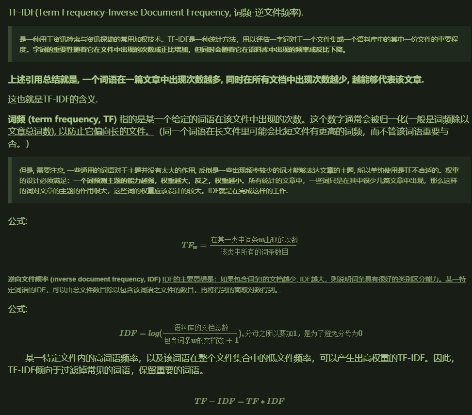

```py
from sklearn.feature_extraction.text import TfidfVectorizer
import jieba

def main():
    str1 = "1、今天很残酷，明天更残酷，后天很美好， 但绝对大部分是死在明天晚上，所以每个人不要放弃今天。"
    str2 = "2、我们看到的从很远星系来的光是在几百万年之前发出的， 这样当我们看到宇宙时，我们是在看它的过去。"
    str3 = "3、如果只用一种方式了解某样事物，你就不会真正了解它。 了解事物真正含义的秘密取决于如何将其与我们所了解的事物相联系。"
    str1_cut = jieba.cut(str1)
    str2_cut = jieba.cut(str2)
    str3_cut = jieba.cut(str3)
    str1_s = " ".join(str1_cut)
    str2_s = " ".join(str2_cut)
    str3_s = " ".join(str3_cut)
    tifid = TfidfVectorizer()
    rdata = tifid.fit_transform([str1_s, str2_s, str3_s])
    print(tifid.get_feature_names())
    print(rdata.toarray())
    print(rdata)

if __name__ == "__main__":
    main()

"""
['一种', '不会', '不要', '之前', '了解', '事物', '今天', '光是在', '几百万年', '发出', '取决于', '只用', '后天', '含义', '大部分', '如何', '如果', '宇宙', '我们', '所以', '放弃', '方式', '明天', '星系', '晚上', '某样', '残酷', '每个', '看到', '真正', '秘密', '绝对', '美好', '联系', '过去', '这样']
[[0.         0.         0.21821789 0.         0.         0.
  0.43643578 0.         0.         0.         0.         0.
  0.21821789 0.         0.21821789 0.         0.         0.
  0.         0.21821789 0.21821789 0.         0.43643578 0.
  0.21821789 0.         0.43643578 0.21821789 0.         0.
  0.         0.21821789 0.21821789 0.         0.         0.        ]
 [0.         0.         0.         0.2410822  0.         0.
  0.         0.2410822  0.2410822  0.2410822  0.         0.
  0.         0.         0.         0.         0.         0.2410822
  0.55004769 0.         0.         0.         0.         0.2410822
  0.         0.         0.         0.         0.48216441 0.
  0.         0.         0.         0.         0.2410822  0.2410822 ]
 [0.15698297 0.15698297 0.         0.         0.62793188 0.47094891
  0.         0.         0.         0.         0.15698297 0.15698297
  0.         0.15698297 0.         0.15698297 0.15698297 0.
  0.1193896  0.         0.         0.15698297 0.         0.
  0.         0.15698297 0.         0.         0.         0.31396594
  0.15698297 0.         0.         0.15698297 0.         0.        ]]

  # 一个数组对应一篇文章，数大小对应词在该篇文章中的的重要性
"""
```

## 2.3. 数据预处理

### 2.3.1. 概述

- 定义：通过特定的统计方法（数学方法）将数据转换成算法要求的数据

- 处理：

  - 数值型数据：标准缩放：
    - 1、归一化
    - 2、标准化
    - 3、缺失值(pandas 和 numpy 都可以进行处理)
  - 类别型数据：one-hot 编码 （字典类型数据抽取）
  - 时间类型：时间的切分(根据情况处理字符串)

- api：`sklearn.preprocessing`

### 2.3.2. 归一化 Normalization

> 不怎么使用

- 特点：通过对原始数据进行变换把数据映射到一定范围(默认为[0,1])之间
- 目的：避免因数值而影响特征的。
  > 比如身高和体重 与 健康程度的关系，因为本身就不是同一范围，直接使用的话，所占权也不同
- 缺点：受异常点影响打（特别是最大最小值受影响时），鲁棒性较差。**只适合传统精确小数据**

  - 鲁棒性 Robustness，也就是健壮性

- 公式：

  > 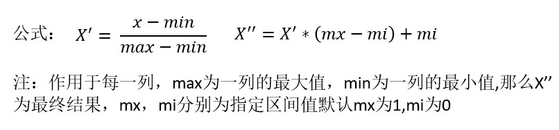

- api:`sklearn.preprocessing.MinMaxScaler(feature_range=(0,1),...)`
  - MinMaxScalar.fit_transform(X)
    - X:numpy array 格式的数据[n_samples,n_features]
    - 返回值：转换后的形状相同的 array

```py
from sklearn.preprocessing import MinMaxScaler

def main():
    mm = MinMaxScaler()
    # 默认就是 mm = MinMaxScaler(feature_range=(0,1))
    rdata = mm.fit_transform( [[90, 2, 10, 40], [60, 4, 15, 45], [75, 3, 13, 46]])
    print(mm.feature_range)
    print(rdata)
    pass

if __name__ == "__main__":
    main()
```

### 2.3.3. 标准化 standardization

- 特点：通过对原始数据进行变换把数据变换到均值为 0,方差为 1 范围内
  > 在已有样本足够多的情况下比较稳定，适合现代嘈杂大数据场景
- 公式：

  > 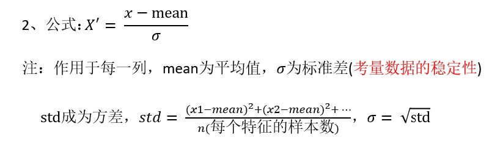

- api:`sklearn.preprocessing.StandardScaler`
  - 处理之后每列来说所有数据都聚集在
    - 均值:0 附近
    - 方差为 1
  - StandardScaler.fit_transform(X,y)
    - X:numpy array 格式的数据[n_samples,n_features]
    - 返回值：转换后的形状相同的 array
  - StandardScaler.mean\_
    - 原始数据中每列特征的平均值
  - StandardScaler.std\_
    - 原始数据每列特征的方差

```py
from sklearn.preprocessing import StandardScaler

def main():
    stdv = StandardScaler()
    rdata = stdv.fit_transform( [[ 1., -1., 3.], [ 2., 4., 2.], [ 4., 6., -1.]])
    print(rdata)

if __name__ == "__main__":
    main()
```

### 2.3.4. 缺失值处理

> 单纯用 numpy 和 pandas 就能完成

- 插补：可以通过缺失值每行或者每列的平均值、中位数来填充
- api:`sklearn.preprocessing.Imputer`
  - Imputer(missing_values='NaN', strategy='mean', axis=0)
    - 完成缺失值插补
  - Imputer.fit_transform(X,y)
    - X:numpy array 格式的数据[n_samples,n_features]
    - 返回值：转换后的形状相同的 array

## 2.4. 数据降维

- 维度：特征的数量

### 2.4.1. 特征选择

#### 2.4.1.1. 说明

- 原因：

  - 冗余：部分特征的相关度高，容易消耗计算性能
  - 噪声：部分特征对预测结果有负影响

- 定义：
  ```
  特征选择就是单纯地从提取到的所有特征中选择部分特征作为训练集特征，
  特征在选择前和选择后可以改变值、也不改变值，但是选择后的特征维数肯
  定比选择前小，毕竟我们只选择了其中的一部分特征。
  ```
- 主要方法:
  - **Filter(过滤式):VarianceThreshold**
    > variance:方差<br>
    > threshold:入口；门槛；开始；极限；临界值
  - **Embedded(嵌入式)：正则化、决策树**:后面算法时再讲
  - Wrapper(包裹式)：基本不用
- 其他方法：
  - **神经网络**，之后再说
  - 线性判别分析 LDA（基本不用）

#### 2.4.1.2. VarianceThreshold

- api:`sklearn.feature_selection.VarianceThreshold`
  - VarianceThreshold(threshold = 0.0)
    > 默认 threshold=0.0。要根据实际情况取值
    - 删除所有低方差特征
  - Variance.fit_transform(X,y)
    - X:numpy array 格式的数据[n_samples,n_features]
    - 返回值：训练集差异低于 threshold 的特征将被删除。
    - 默认值是保留所有非零方差特征，即删除所有样本
    - 中具有相同值的特征。

```py
from sklearn.feature_selection import VarianceThreshold

def main():
    vt = VarianceThreshold()
    rdata = vt.fit_transform([[0, 2, 0, 3], [0, 1, 4, 3], [0, 1, 1, 3]])
    print(rdata)

if __name__ == "__main__":
    main()
    """
    结果：
    [[2 0]
    [1 4]
    [1 1]]

    即删除了一样的列
    """
```

### 2.4.2. PCA(主成分分析)

#### 2.4.2.1. 说明

> 当特征成百上千时，就需要考虑了

> **原理自己查**

- 本质：PCA 是一种分析、简化数据集的技术。
- 目的：是数据维数压缩，尽可能降低原数据的维数（复杂度），损失少量信息。
  > 比如 feature1 和 featrue2 间为线性关系，那么就可以删除其中一个
- 作用：可以削减回归分析或者聚类分析中特征的数量
- api:`sklearn.decomposition.PCA`
  - PCA(n_components=None)
    > n_components:<br>
    > 小数，0~1 的百分比，表示信息的损失量，一般为 0.9~0.95<br>
    > 整数：减少到的特征数量。**一般不用**
    - 将数据分解为较低维数空间
  - PCA.fit_transform(X)
    - X:numpy array 格式的数据[n_samples,n_features]
    - 返回值：转换后指定维度的 array

```py
from sklearn.decomposition import PCA

def main():
    pca = PCA(n_components=0.9)
    rdata = pca.fit_transform([[2, 8, 4, 5], [6, 3, 0, 8], [5, 4, 9, 1]])
    print(rdata)

if __name__ == "__main__":
    main()
```

#### 2.4.2.2. 降维案例

[数据](https://www.kaggle.com/c/instacart-market-basket-analysis/data)

## 2.5. 数据集

> scikit-learn有内置数据集

- 可将数据集划分为划分为：
  - 训练数据集
  - 测试数据集

> 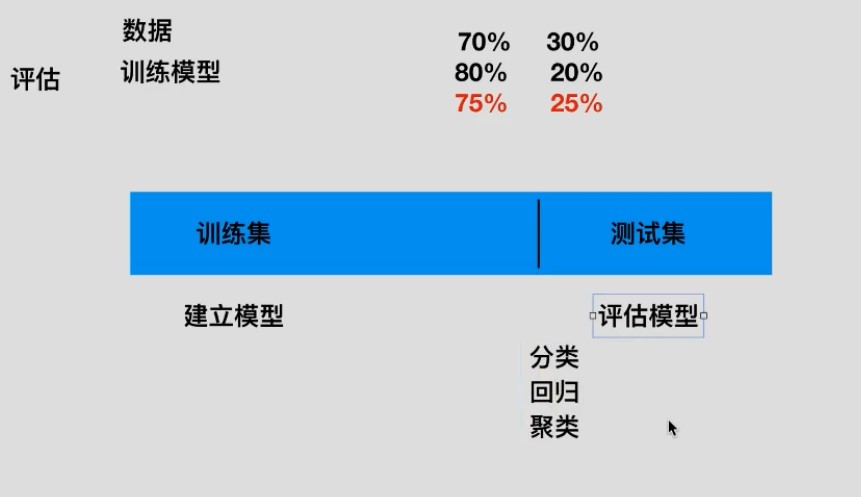

- api:
  - 获取：
    - sklearn.datasets
      > 加载获取流行数据集
      - `datasets.load_*()`
        > 获取小规模数据集，数据包含在datasets里
      - `datasets.fetch_*(data_home=None)`
        > 获取大规模数据集，需要从网络上下载，函数的第一个参数是data_home，表示数据集下载的目录,默认是 ~/scikit_learn_data/<br>
        > subset: 'train'或者'test','all'，可选，选择要加载的数据集. 训练集的“训练”，测试集的“测试”，两者的“全部”
    - 数据格式；
      - load*和fetch*返回的数据类型datasets.base.Bunch(字典格式)
      - data：特征数据数组，是 [n_samples * n_features] 的二维 numpy.ndarray 数组
      - target：目标值数组，是 n_samples 的一维 numpy.ndarray 数组
      - DESCR：数据描述
      - feature_names：特征名,新闻数据，手写数字、回归数据集没有
      - target_names：标签名,回归数据集没有
  - 划分：`sklearn.model_selection.train_test_split(*arrays, **options)`
    - x:  数据集的特征值
    - y:  数据集的标签值
    - test_size      测试集的大小，一般为float
    - random_state        随机数种子,不同的种子会造成不同的随机 采样结果。相同的种子采样结果相同。
    - return  训练集特征值，测试集特征值，训练标签，测试标签 (默认随机取)	
  - 清楚：
    - `datasets.clear_data_home(data_home=None)`
      > 清除目录下的数据

## 2.6. 转换器与估计器

### 2.6.1. 转换器

> 特征工程，数据处理所用api

- 通用：
  - fit():输入数据，但不进行处理。但会计算些平均值和方差，或者词列表等前提操作，这些值会存储到处理对象中，比如StandScaler
    > **所以不能fit完一个数据，再transform另一个数据，会乱套**
  - transform():数据处理。根据fit()得到的结果，再进行处理
  - fit_transform():输入数据，直接转换。**一般使用这个即可，上面两个基本不用**
    > 等于 fit()+transform()


### 2.6.2. 估计器

- 定义：在sklearn中，估计器(estimator)是一个重要的角色，分类器和回归器都属于estimator，是一类实现了算法的API
  > 实现算法api

- 用于分类的估计器
  - sklearn.neighbors	k-近邻算法
  - sklearn.naive_bayes      贝叶斯
  - sklearn.linear_model.LogisticRegression     逻辑回归
- 用于回归的估计器
  - sklearn.linear_model.LinearRegression     线性回归
  - sklearn.linear_model.Ridge      岭回归 

- 通用：
  - fit()：进行训练
  - prediec():预估结果
  - score():准确率

## 2.7. api总结

### 2.7.1. api总结

- 数据抽取：
  - 字典类型数据抽取:`sklearn.feature_extraction.DictVectorizer`
  - 文本特征数据抽取:
    - count:`sklearn.feature_extraction.text.CountVectorizer`
    - tf-idf:`sklearn.feature_extraction.text.TfidfVectorizer`
- 数据预处理
  - 归一化：`sklearn.preprocessing.MinMaxScaler(feature_range=(0,1),...)`
  - 标准化:`sklearn.preprocessing.StandardScaler`
  - 缺失值:`sklearn.preprocessing.Imputer`
- 数据降维
  - 特征选择:`sklearn.feature_selection.VarianceThreshold`
  - PCA:`sklearn.decomposition.PCA`


### 2.7.2. api大致使用流程

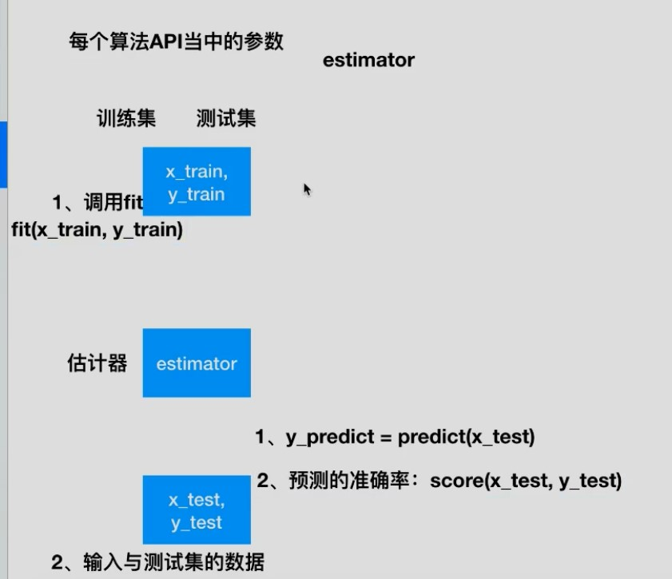

# 3. 基本算法

> 此处只会讲解基本概念和api使用。算法实现不做总结

## 3.1. 监督学习

### 3.1.1. 分类

#### 3.1.1.1. k-近邻算法

> 基本不咋用

- 看《算法图解》
- 需要做标准化处理
- api:sklearn.neighbors.KNeighborsClassifier(n_neighbors=5,algorithm='auto')
  - n_neighbors：int,可选（默认= 5），k_neighbors查询默认使用的邻居数 
  - algorithm：{‘auto’，‘ball_tree’，‘kd_tree’，‘brute’}，可选用于计算最近邻居的算法：‘ball_tree’将会使用 BallTree，‘kd_tree’将使用 KDTree。‘auto’将尝试根据传递给fit方法的值来决定最合适的算法。 (不同实现方式影响效率)

- 优点：
  - 简单，易于理解，易于实现，无需估计参数，无需训练
- 缺点：
  - 懒惰算法，对测试样本分类时的计算量大，内存开销大
  - 必须指定K值，K值选择不当则分类精度不能保证

```py
import numpy as np
import pandas as pd
from sklearn import neighbors
from sklearn.datasets import load_iris
from sklearn.model_selection import train_test_split
from sklearn.preprocessing import MinMaxScaler

# 获取数据
iris_data = load_iris()

# 数据描述
print(iris_data.DESCR)

# 查看部分数据
print(iris_data.data[:5, :])

# 归一化
mm = MinMaxScaler()
x_data = mm.fit_transform(iris_data.data)

# 权重处理(尝试)
# x_data[:,[0]] = x_data[:,[0]]/(1-0.7826)
# x_data[:,[1]] = x_data[:,[0]]/(1+0.4194)
# x_data[:,[2]] = x_data[:,[0]]/(1-0.9490)

# 数据划分
x_train, x_test, y_train, y_test = train_test_split(
    x_data, iris_data.target, test_size=0.25)

# 实例化knn对象
knn = neighbors.KNeighborsClassifier(n_neighbors=5,)

# 尝试添加权重
# knn = neighbors.KNeighborsClassifier(n_neighbors=5, metric="wminkowski", metric_params={
#                                      "w": [0.7826, -0.4194, 0.9490, 0.9565]})

# 加载数据
knn.fit(x_train, y_train)

# 预测值
knn.predict(x_test)

# 准确率
knn.score(x_test, y_test)
```


#### 3.1.1.2. 朴素贝叶斯分类

[讲解](https://zhuanlan.zhihu.com/p/26262151)

```py
import numpy as np
import pandas as pd
from sklearn.datasets import fetch_20newsgroups
from sklearn.model_selection import train_test_split
from sklearn.feature_extraction.text import TfidfVectorizer
from sklearn.naive_bayes import MultinomialNB

news = fetch_20newsgroups(subset='all')
x_train,x_test,y_train,y_test = train_test_split(news.data,news.target,test_size=0.25)

# 数据处理
tf = TfidfVectorizer()
x_train = tf.fit_transform(x_train)
x_test = tf.transform(x_test) # 注意，这里用trainsform，没有fit，要以train为标准

# 创建朴素贝叶斯api对象
mlt = MultinomialNB(alpha=1.0)

# 进行训练
mlt.fit(x_train,y_train)

# 预测值
mlt.predict(x_test)

# 准确率
mlt.score(x_test,y_test)
```

- 特点
  - 无法传入参数进行调整，训练集影响大
  - 不需要调参
  - 训练集误差会大大影响结果

- 优点：
  - 朴素贝叶斯模型发源于古典数学理论，有稳定的分类效率。
  - 对缺失数据不太敏感，算法也比较简单，常用于文本分类。
  - 分类准确度高，速度快
- 缺点：
  - 由于使用了样本属性独立性的假设，所以如果样本属性有关联时 其效果不好

> 神经网络的效果要比朴素贝叶斯要好

#### 3.1.1.3. 分类模型评估

> 在分类任务下，预测结果(Predicted Condition)与正确标记(True Condition)之间存在四种不同的组合，构成混淆矩阵(适用于多分类)

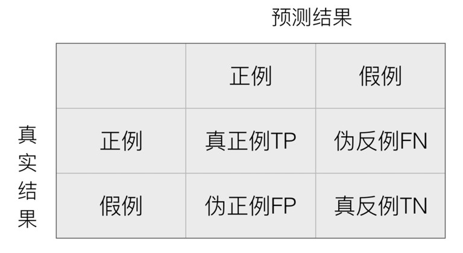


- 混淆矩阵
  - 精确率:预测结果为正例样本中真实为正例的比例（查得准）
    > 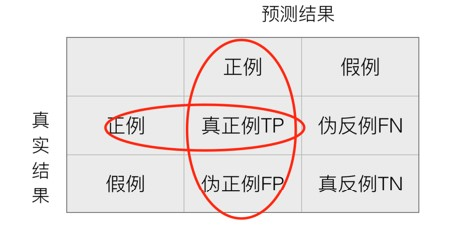
  - 召回率:真实为正例的样本中预测结果为正例的比例（查的全，对正样本的区分能力）
    > 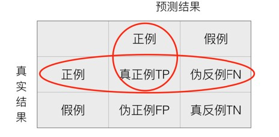
  - 其他分类标准，F1-score，反映了模型的稳健型
    > 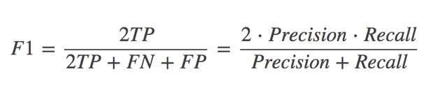

- api:`sklearn.metrics.classification_report `
  - y_true：真实目标值 
  - y_pred：估计器预测目标值 
  - target_names：目标类别名称 
  - return：每个类别精确率与召回率

#### 3.1.1.4. 模型选择与调优

##### 3.1.1.4.1. 交叉验证

> 一般和网格搜索搭配

- 目的：交叉验证：为了让被评估的模型更加准确可信
- 过程：
  ```
  交叉验证：将拿到的训练数据，分为训练和验证集。以下图为例：
  将数据分成5份，其中一份作为验证集。
  然后经过5次(组)的测试，每次都更换不同的验证集。
  即得到5组模型的结果，取平均值作为最终结果。又称5折交叉验证。
  ```
  > 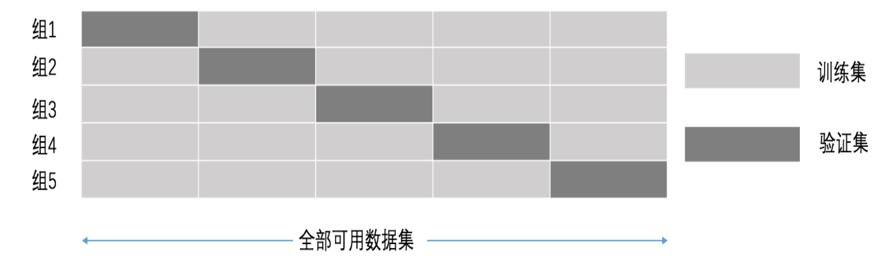


##### 3.1.1.4.2. 网格搜索

> 一般与交叉验证搭配

- 说明：
  ```
  通常情况下，有很多参数是需要手动指定的（如k-近邻算法中的K值），
  这种叫超参数。但是手动过程繁杂，所以需要对模型预设几种超参数组
  合。每组超参数都采用交叉验证来进行评估。最后选出最优参数组合建
  立模型。
  ```
- 过程：
  - 就是一个穷举。每个参数值都用交叉验证得到模型
  - 参数间相互组合
  - 选取最好的模型

- api:`sklearn.model_selection.GridSearchCV`
  > 对估计器的指定参数值进行详尽搜索
  - 参数
    - estimator：估计器对象
    - param_grid：估计器参数(dict){“n_neighbors”:[1,3,5]}
    - cv：指定几折交叉验证
    - fit：输入训练数据
    - score：准确率
  - 结果分析：
    - best_score_:在交叉验证中测试的最好结果
    - best_estimator_：最好的参数模型
    - cv_results_:每次交叉验证后的测试集准确率结果和训练集准确率结果


#### 3.1.1.5. 决策树与随机森林

##### 3.1.1.5.1. 决策树

> 企业过程中使用较多

- 原理：信息论基础
  - 信息熵的计算
  - 条件熵的计算
    > 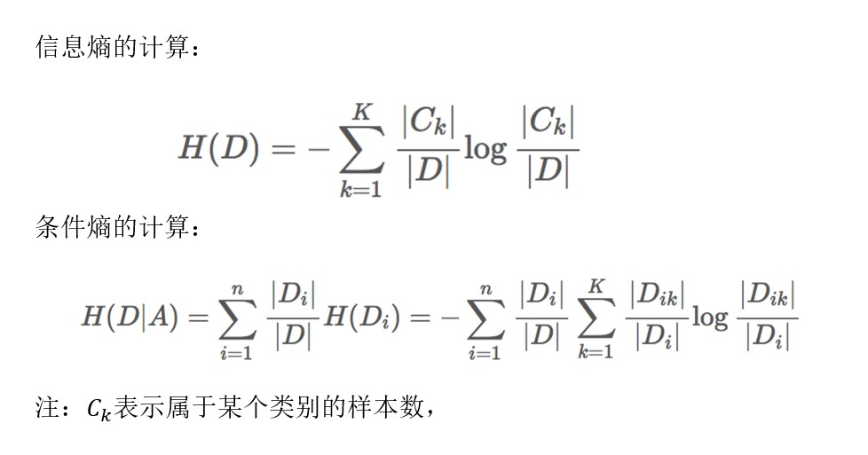
  - 信息增益的计算
    > 信息增益：当得知一个特征条件之后，减少的信息熵的大小
    > 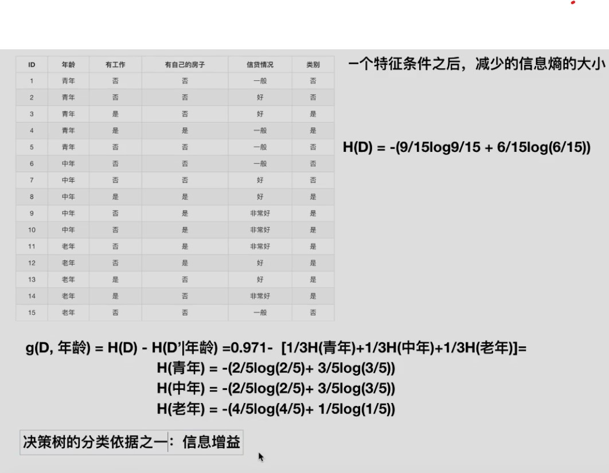

- 信息增益大的作为最开始的分类。
  > 信息增益越大，越有可能得出结果。大的放前面有利于不进行多余的判断
  > 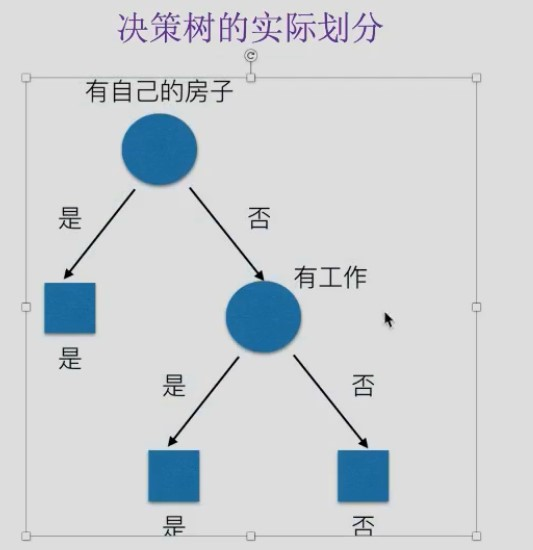

- 算法(了解)：
  > 在sklearn中可以选择划分的原则
  - ID3
    - 信息增益 最大的准则
  - C4.5
    - 信息增益比 最大的准则
  - CART 
    - 回归树: 平方误差 最小 
    - 分类树: 基尼系数   最小的准则 
- api:`sklearn.tree.DecisionTreeClassifier(criterion=’gini’, max_depth=None,random_state=None)`
  - 使用
    > 决策树分类器<br>
    > 超参数放在随机森林
    - decision_path:返回决策树的路径
    ```python
    DecisionTreeClassifier(
    *,
    criterion='gini', # 默认是’gini’系数，也可以选择信息增益的熵’entropy’
    splitter='best',
    max_depth=None, # 树的深度最大大小
    min_samples_split=2, # 样本数大于两个时才会分叉
    min_samples_leaf=1, # 样本数大于1个时，节点才会被留下
    min_weight_fraction_leaf=0.0,
    max_features=None,
    random_state=None, # 随机数种子
    max_leaf_nodes=None,
    min_impurity_decrease=0.0,
    min_impurity_split=None,
    class_weight=None,
    presort='deprecated',
    ccp_alpha=0.0,
    )
    ```
  - 模型保存
    - 1、sklearn.tree.export_graphviz() 该函数能够导出DOT格式
      ```
      tree.export_graphviz(estimator,out_file='tree.dot’,feature_names=[‘’,’’]) 
      ```
    - 2、工具:(能够将dot文件转换为pdf、png)
      ```
      安装graphviz
      ubuntu:sudo apt-get install graphviz                    Mac:brew install graphviz 

      运行命令
      然后我们运行这个命令
      $ dot -Tpng tree.dot -o tree.png
      ```

- 示例：
  - 泰坦尼克号存活率

- 优缺点：
  - 优点：
    - 简单的理解和解释，树木可视化。
    - 需要很少的数据准备，其他技术通常需要数据归一化，
  - 缺点：
    - 决策树学习者可以创建不能很好地推广数据的过于复杂的树， 这被称为过拟合。 
    - 决策树可能不稳定，因为数据的小变化可能会导致完全不同的树被生成 
  - 改进：
    - 减枝cart算法
      - 创建api对象时设置参数：
        ```python
        min_samples_split=2, # 样本数大于两个时才会分叉
        min_samples_leaf=1, # 样本数大于1个时，节点才会被留下
        ```
    - 随机森林

##### 3.1.1.5.2. 随机森林

- 集成学习方法：
  ```
  集成学习通过建立几个模型组合的来解决单一预测问题。
  它的工作原理是生成多个分类器/模型，各自独立地学习和作出预测。
  这些预测最后结合成单预测，因此优于任何一个单分类的做出预测。
  ```
- 随机森林：
  ```
  在机器学习中，随机森林是一个包含多个决策树的分类器，并且其输出的类别是由个别树输出的类别的众数而定。
  ```

- 随机森林创建过程：
  1. 单棵树创建过程
    1. 随机在M个特征中选出m个特征,m应远小于M
    2. 随机从N个样本中选择一个样本，重复N次。随机放回抽样(bootstrap抽样),样本有可能重复
    3. 使用抽取的样本，训练模型,并用未抽到的样本作预测，评估其误差。
  2. 重复操作，建立指定数量的决策树

- 问题：
  - 为什么要随机抽样训练集？　　
    ```
    如果不进行随机抽样，每棵树的训练集都一样，那么最终训练出的树分类结果也是完全一样的 
    ```
  - 为什么要有放回地抽样？
    ```
    如果不是有放回的抽样，那么每棵树的训练样本都是不同的，都是没有交集的，这样每棵树都是“有偏的”，都是绝对“片面的”（当然这样说可能不对），也就是说每棵树训练出来都是有很大的差异的；而随机森林最后分类取决于多棵树（弱分类器）的投票表决。
    ```
- api:
  ```py
  class sklearn.ensemble.RandomForestClassifier(
    n_estimators=10, #  森林里的树木数量。推荐：120,200,300,500,800,1200
    *,
    criterion=’gini’, # 分割特征的测量方法
    max_depth=None, #可选（默认=无）树的最大深度  
    min_samples_split=2,
    min_samples_leaf=1,
    min_weight_fraction_leaf=0.0,
    max_features='auto', # 每棵决策树选取的最大的特征数量（m的最大值）
      # 查文档即可
      # - If int, then consider `max_features` features at each split.
      # - If float, then `max_features` is a fraction and
      #   `int(max_features * n_features)` features are considered at each
      #   split.
      # - If "auto", then `max_features=sqrt(n_features)`.
      # - If "sqrt", then `max_features=sqrt(n_features)` (same as "auto").
      # - If "log2", then `max_features=log2(n_features)`.
      # - If None, then `max_features=n_features`.
    max_leaf_nodes=None,
    min_impurity_decrease=0.0,
    min_impurity_split=None,
    bootstrap=True, # 是否在构建树时使用放回抽样 
    oob_score=False,
    n_jobs=None,
    random_state=None,
    verbose=0,
    warm_start=False,
    class_weight=None,
    ccp_alpha=0.0,
    max_samples=None,
  )
  ```

- 优点：
  - 在当前所有算法中，具有极好的准确率
  - 能够有效地运行在大数据集上
  - 能够处理具有高维特征的输入样本，而且不需要降维
  - 能够评估各个特征在分类问题上的重要性
  - 对于缺省值问题也能够获得很好得结果


### 3.1.2. 回归

#### 3.1.2.1. 线性回归

> 看机器学习文档

- api:
  - 正规方程：sklearn.linear_model.LinearRegression()
    - 普通最小二乘法线性回归
    - coef_：回归系数
  - 梯度下降：sklearn.linear_model.SGDRegressor( )
    - 通过使用SGD最小化线性模型
    - coef_：回归系数
- 回归评估API:sklearn.metrics.mean_squared_error
  > 均方误差回归损失
  - y_true:真实值
  - y_pred:预测值
    > 注：真实值，预测值为标准化之前的值
  - return:浮点数结果

- 两种回归比较：
  > 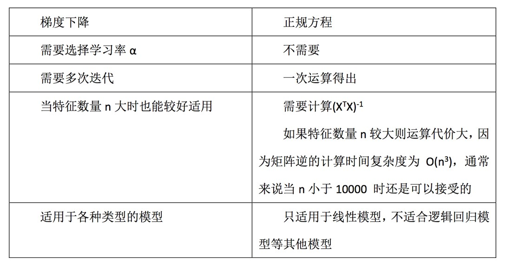
- LinearRegression与SGDRegressor评估
  - 特点：线性回归器是最为简单、易用的回归模型。
  - 从某种程度上限制了使用，尽管如此，在不知道特征之 间关系的前提下，我们仍然使用线性回归器作为大多数 系统的首要选择。
    - 小规模数据：LinearRegression(不能解决拟合问题)以及其它
    - 大规模数据：SGDRegressor
  
- 线性回归问题：
  - 欠拟合
  - 过拟合
  - 解决：
    - 过滤式：选择地方差特征
    - 嵌入式：决策树，神经网络，正则化（岭回归）

#### 3.1.2.2. 岭回归

- L2正则化：岭回归，带有正则化的线性回归
- api:sklearn.linear_model.Ridge
  > 具有l2正则化的线性最小二乘法
  - alpha(0~1):正则化力度
    > **面试问题：**回归过拟合调优方式？<br>
    > 正则化，岭回归，调整alpha参数大小
  - coef_:回归系数

> 岭回归：回归得到的回归系数更符合实际，更可靠。另外，能让 估计参数的波动范围变小，变的更稳定。在存在病态数据偏多的研 究中有较大的实用价值。

#### sklearn模型的保存与加载

> 文件格式：pkl
- 保存：joblib.dump(rf,"test.pkl")
- 加载：estimator = joblib.load("test.pkl")

#### 3.1.2.3. 逻辑回归

> 用于二分类

- 应用：
  - 广告点击率 
  - 判断用户的性别
  - 预测用户是否会购买给定的商品类 
  - 判断一条评论是正面的还是负面的
- 优点：适合需要得到一个分类概率的场景
- 缺点：当特征空间很大时，逻辑回归的性能不是很好 （看硬件能力）
- 原理：sigmoid函数，将变量映射到0-1之间
  > 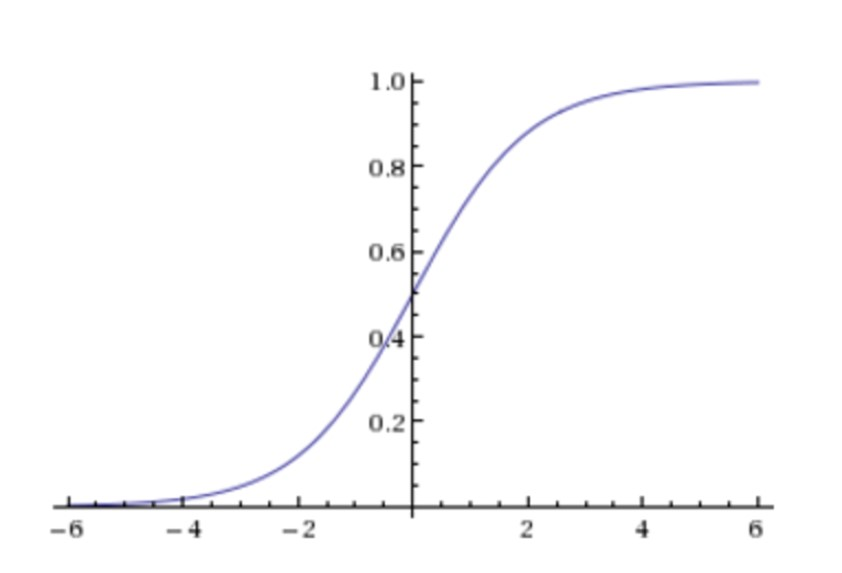

- api: sklearn.linear_model.LogisticRegression
  ```py
  LogisticRegression(
    penalty='l2',
    *,
    dual=False,
    tol=0.0001,
    C=1.0, # 学习率
    fit_intercept=True,
    intercept_scaling=1,
    class_weight=None,
    random_state=None,
    solver='lbfgs',
    max_iter=100,
    multi_class='auto',
    verbose=0,
    warm_start=False,
    n_jobs=None,
    l1_ratio=None,
  )
  ```
- 多分类问题：softmax-方法，将在后面神经网络算法中介绍

- 生成模型和判别模型：
  - 判别模型:如朴素贝叶斯算法，隐马可夫模型，一开始需要从数据中求得一些概率
  - 生成模型:如逻辑回归，决策树等等，不需要事先处理数据

#### 3.1.2.4. 神经网络

### 3.1.3. 标注

#### 3.1.3.1. 隐马尔可夫模型

## 3.2. 无监督学习

### 3.2.1. 聚类

#### 3.2.1.1. k-means

- 无监督学习：只有特征值，没有目标值
- k-means:聚类
- 过程：
  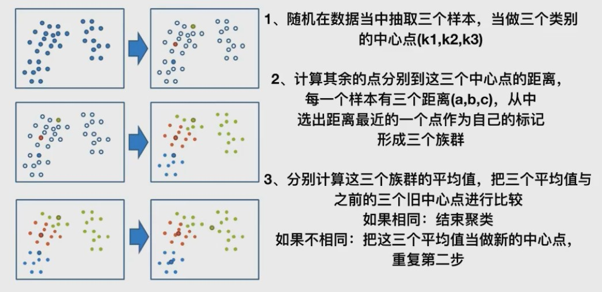
- api:`sklearn.cluster.KMeans`
  - n_clusters:开始的聚类中心数量
  - init:初始化方法，默认为'k-means ++'
  - labels_:默认标记的类型，可以和真实值比较（不是值比较）
- 评估标准：
  > 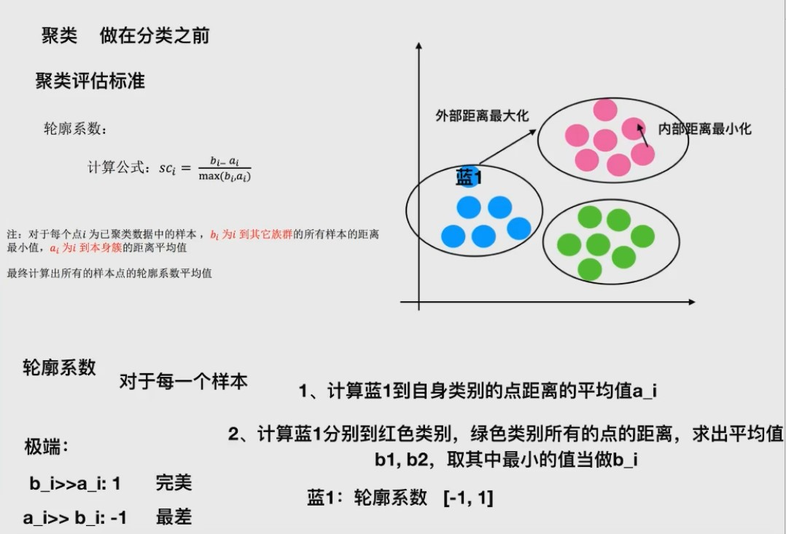
  - 如果〖𝑠𝑐〗_𝑖 小于0，说明𝑎_𝑖 的平均距离大于最近的其他簇。 聚类效果不好
  - 如果〖𝑠𝑐〗_𝑖 越大，说明𝑎_𝑖 的平均距离小于最近的其他簇。 聚类效果好
  - 轮廓系数的值是介于 [-1,1] ，越趋近于1代表内聚度和分离度都相对较优 
- 评估api： `sklearn.metrics.silhouette_score`
  > 计算所有样本的平均轮廓系数
  - X：特征值
  - labels：被聚类标记的目标值

- 缺点：
  - 容易收敛到局部最优解(多次聚类)
  - 需要预先设定簇的数量(k-means++解决)


